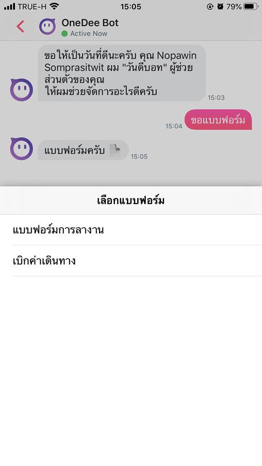

# วิธีการขอแบบฟอร์ม \(Request Form\)

พิมพ์ **"ขอแบบฟอร์ม"** ในช่องแชท ในหน้า Chat เพื่อทำการเรียกดูแบบฟอร์มที่มี

หรือกดปุ่ม **"Quick Menu"** ด้านขวาล่างเพื่อเรียกดูเมนูขอแบบฟอร์ม

กดปุ่ม **"Request Form"** เพื่อทำการเรียกดูแบบฟอร์มต่างๆ ที่ทางแอดมินในบริษัทตั้งไว้ให้

เลือกแบบฟอร์มที่ต้องการ เพื่อดำเนินการขอทำรายการต่อไป


แบบฟอร์มที่มี ต้องทำการสร้างและกำหนดโดยแอดมินในบริษัทของท่านก่อน


