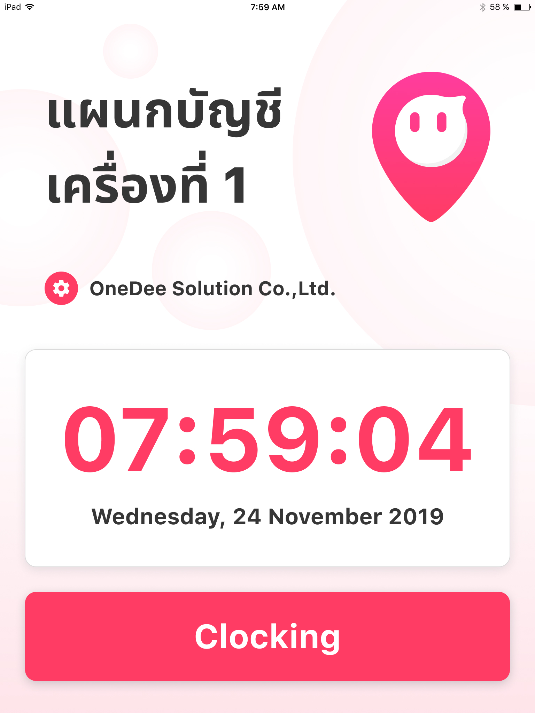
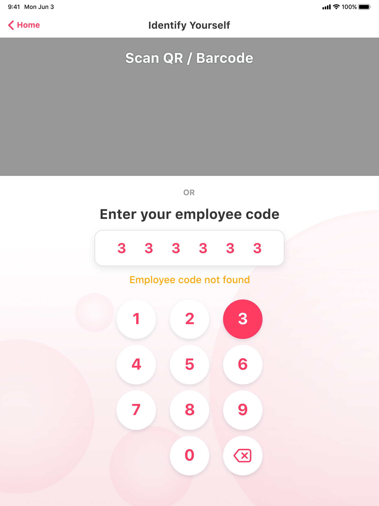
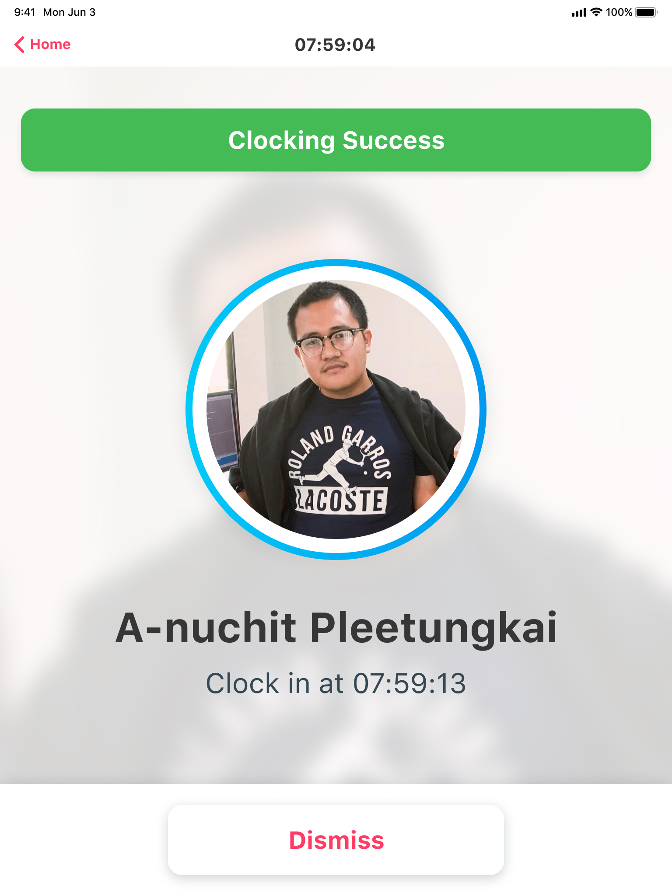

# การลงเวลา OneDee Station

## วิธีการลงเวลาเข้างาน

* แตะ **Clocking** เพื่อเริ่มต้นการลงเวลางาน

* กรอกรหัส **PIN 6 หลัก** ของพนักงานที่ต้องการจะลงเวลา

* ให้พนักงานที่ต้องการลงเวลาอยู่ที่หน้าจอ
* แตะ **Clock in** เพื่อเข้างาน


* **Clock In** = เข้างาน
* **Clock Out** = ออกงาน


* รอระบบดำเนินการตรวจสอบใบหน้าของพนักงานที่ลงเวลาเข้างาน

* หากใบหน้าถูกต้องระบบจะแจ้งข้อความ **Clocking in Success** ด้านบนสีเขียว
* แตะ **Done เพื่อเสร็จสิ้นการลงเวลา**

## วิธีการลงเวลาออกงาน

* แตะ **Clocking** เพื่อเริ่มต้นการลงเวลางาน

* กรอกรหัส **PIN 6 หลัก** ของพนักงานที่ต้องการจะลงเวลา

* ให้พนักงานที่ต้องการลงเวลาอยู่ที่หน้าจอ
* แตะ **Clock in** เพื่อเข้างาน

* ระบบดำเนินการจับตรวจสอบใบหน้าของพนักงานที่ลงเวลาออกงาน

* ถ้าใบหน้าถูกต้องระบบจะแจ้งข้อความ **Clocking out Success** ด้านบนสีเขียว
* กดปุ่ม **Done เพื่อเสร็จสิ้นการลงเวลา**

