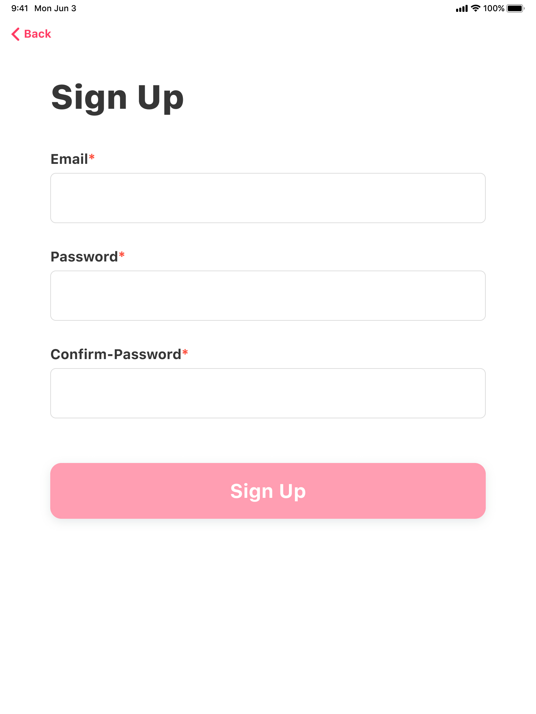
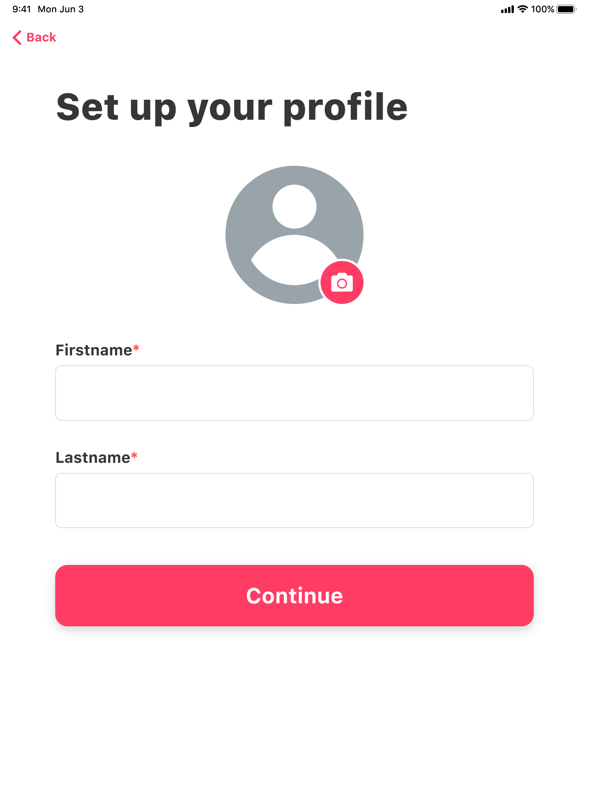
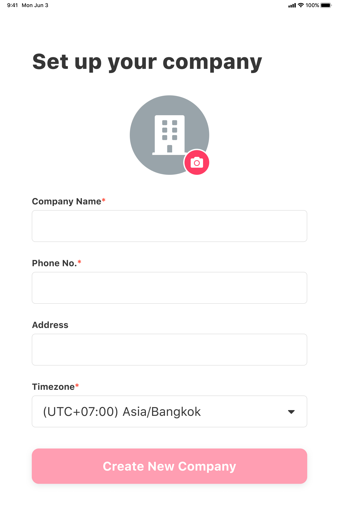
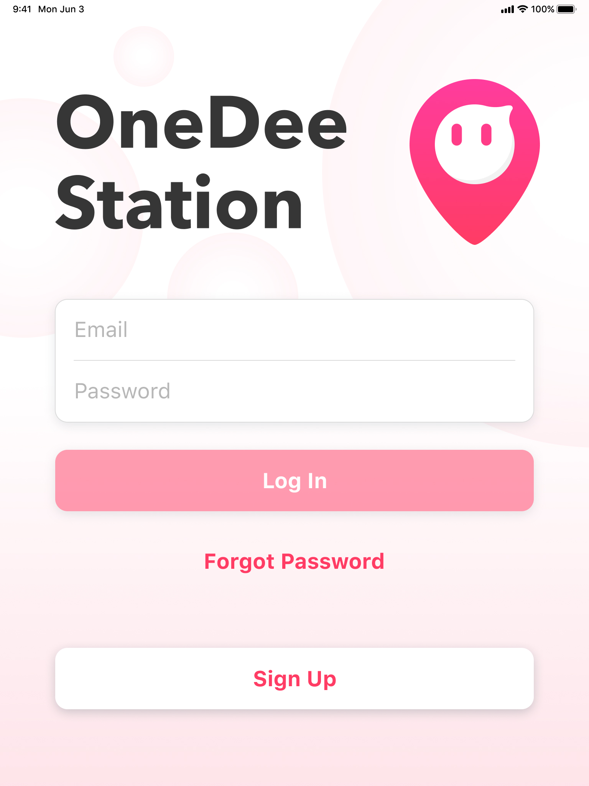
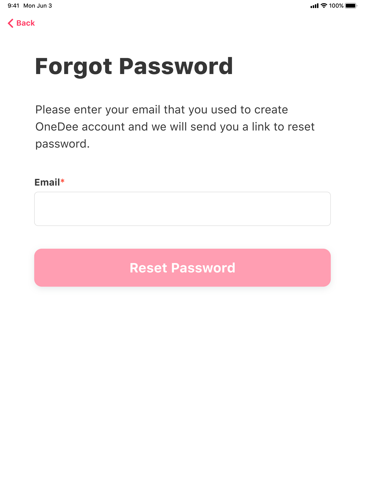

# การสมัครใช้งาน OneDee Station

## การสมัครใช้งาน OneDee Station


OneDee Station ใช้งานได้เฉพาะ iPad เท่านั้น!


* แตะ **Sign Up** เพื่อสมัครใช้งาน **OneDee Station**


ถ้ามี **Account** ที่สมัครผ่าน **app.onedee.ai** แล้วสามารถ **Log In** ได้ตามปกติ


* กรอก **Email**, **Password** และ **Confirm Password**
* แตะ **Sign Up**

* อัพโหลดรูปโปรไฟล์ส่วนตัว
* กรอก **Firstname** และ **Lastname**
* แตะ **Continue**

## วิธีการสร้างบริษัท \(สำหรับผู้ใช้งานใหม่\)

* อัพโหลดรูปภาพบริษัท
* กรอก **Company Name, Phone No, Address** และเลือก **Timezone**
* แตะ **Create New Company**

## วิธีการ Reset Password \(ในกรณีที่ลืม Password\)

* แตะ **Forgot Password**

* กรอก **Email** ที่สมัครใช้งานไว้แล้ว
* แตะ **Reset Password** \(ระบบจะส่งรหัสผ่านไปที่ Email\)

