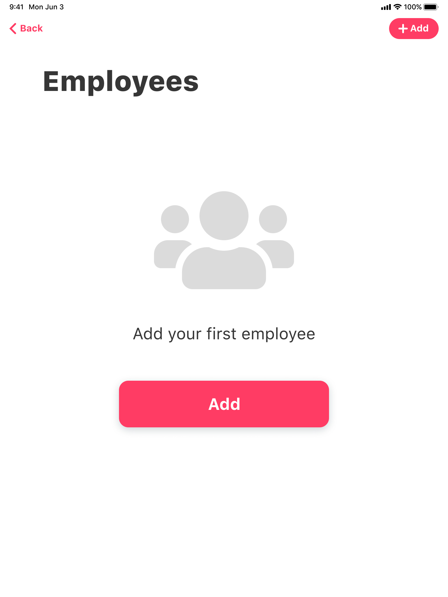
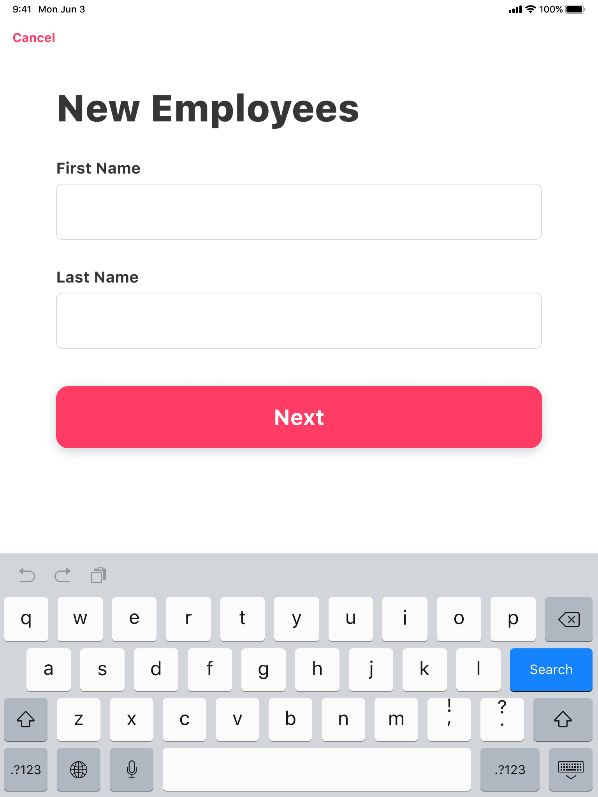
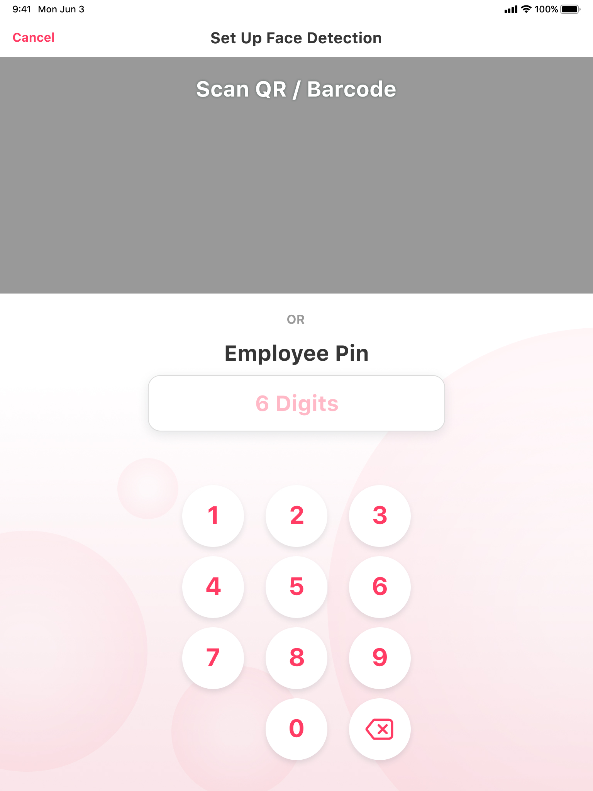
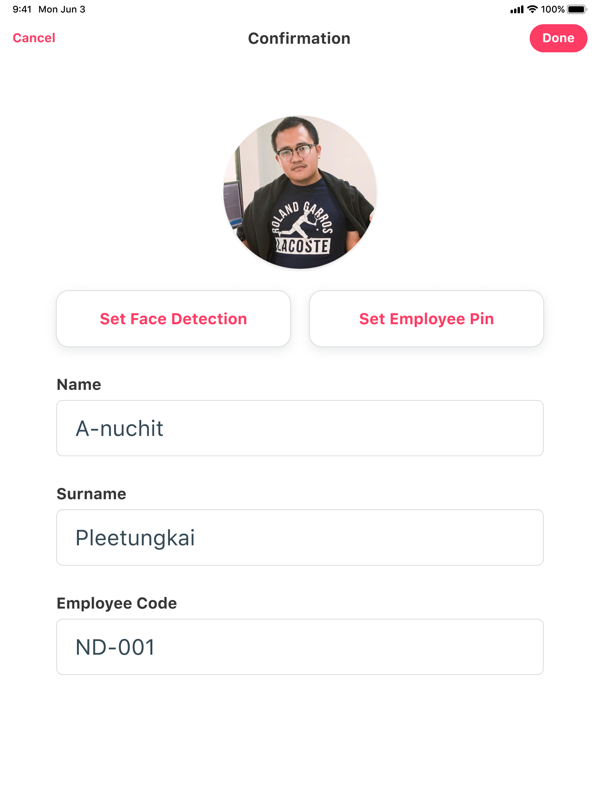

# การเพิ่มพนักงาน

## วิธีการเพิ่มพนักงาน

* แตะ **Add** เพื่อเพิ่มพนักงาน

* กรอก **Firstname** และ **Lastname** ของพนักงาน
* แตะ **Next**

* แตะ **Take a photo** เพื่อถ่ายภาพใบหน้าของพนักงาน

* กดปุ่ม **Continue** เพื่อดำเนินการต่อ และระบบจะบันทึกรูปภาพของพนักงาน 

* แตะ **Testing** เพื่อถ่ายภาพของพนักงานสำหรับยืนยันตัวตนอีกครั้งว่าตรงกับภาพก่อนหน้าหรือไม่

* ตรวจสอบใบหน้าเพื่อถูกต้อง
* แตะ **Done**

* กำหนดรหัส **PIN 6 หลัก** สำหรับพนักงานคนดังกล่าว

* ตรวจสอบความถูกต้องของข้อมูลพนักงานอีกครั้ง
* กดปุ่ม **Done** เพื่อเสร็จสิ้นกะบวนการ


* **Set Face Detection** ถ่ายใบหน้าของพนักงานอีกครั้ง 
* **Set Employee Pin** กำหนดรหัส **PIN 6 หลัก** ของพนักงานอีกครั้ง


