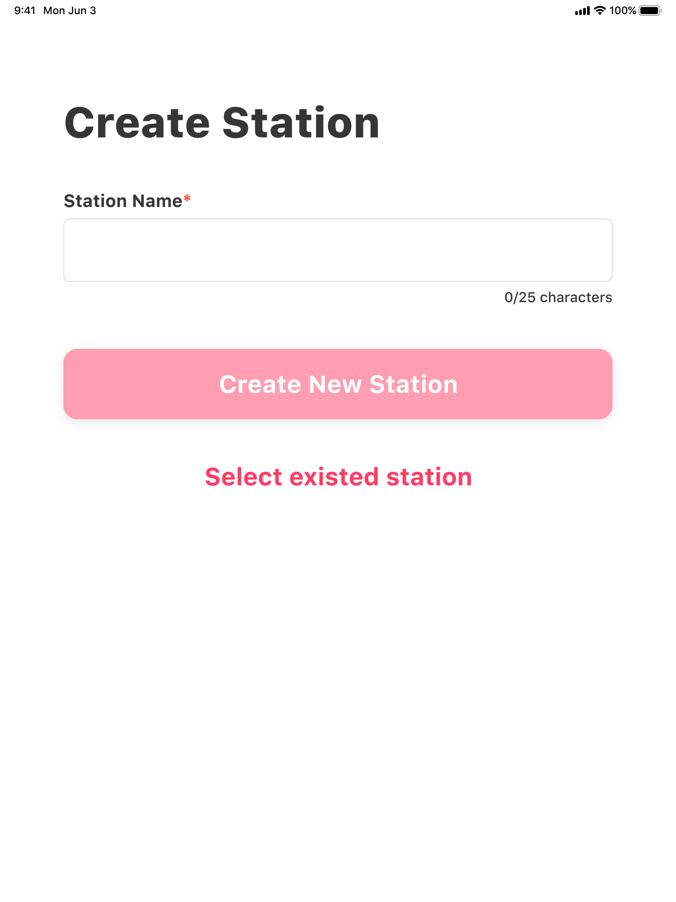

# การสร้าง Station ลงเวลา

## **การสร้าง Station ลงเวลา \(จุดลงเวลา\)**

* กรอกชื่อ **Station** ลงเวลา
* แตะ **Create New Station**


กรณีที่มี **Station** ลงเวลาอยู่แล้ว\(เคยสร้างไว้ก่อน\) สามารถกดปุ่ม **Select existed staion** เพื่อเลือก **Station**


* เลือก **Station** ที่ต้องการให้พนักงานลงเวลางาน

