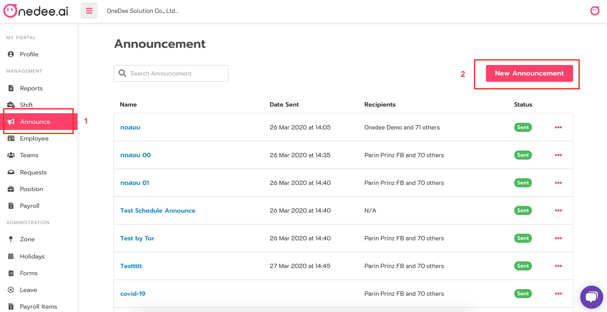
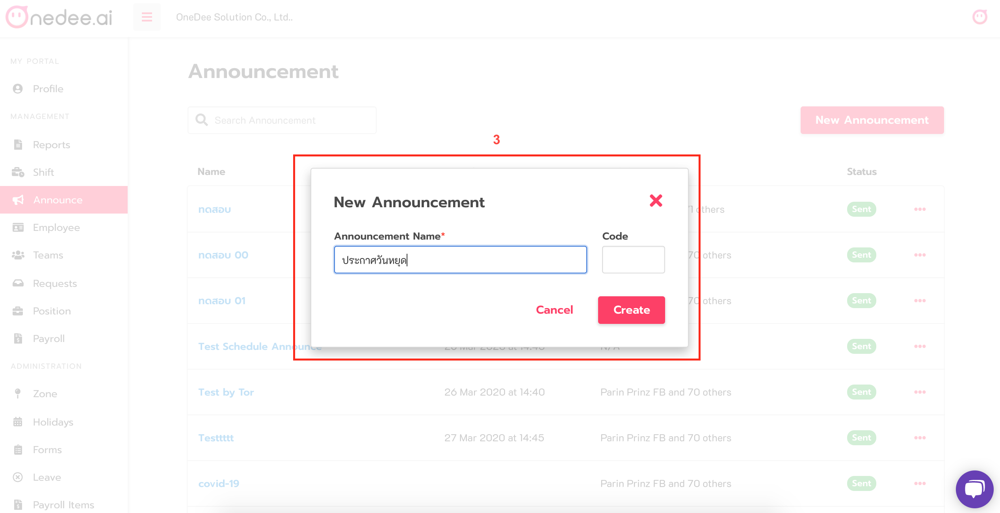
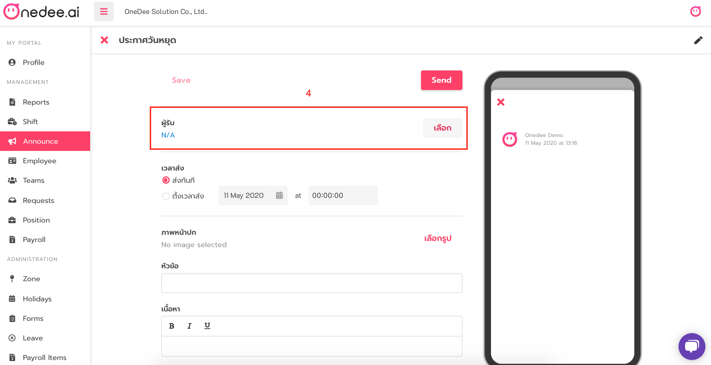
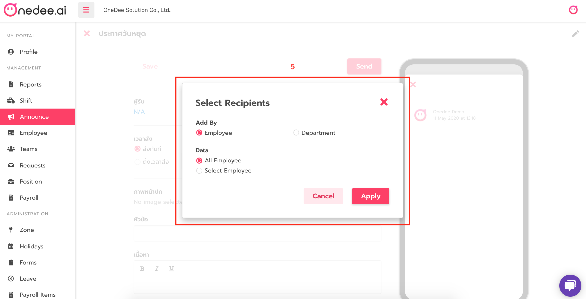
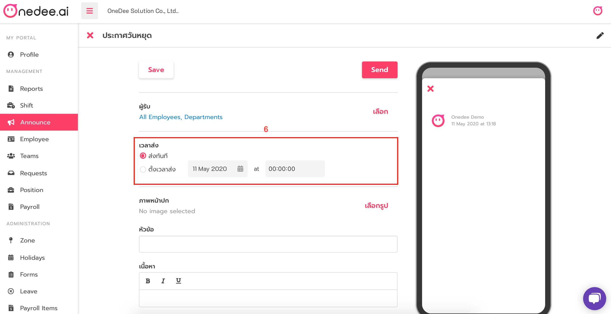
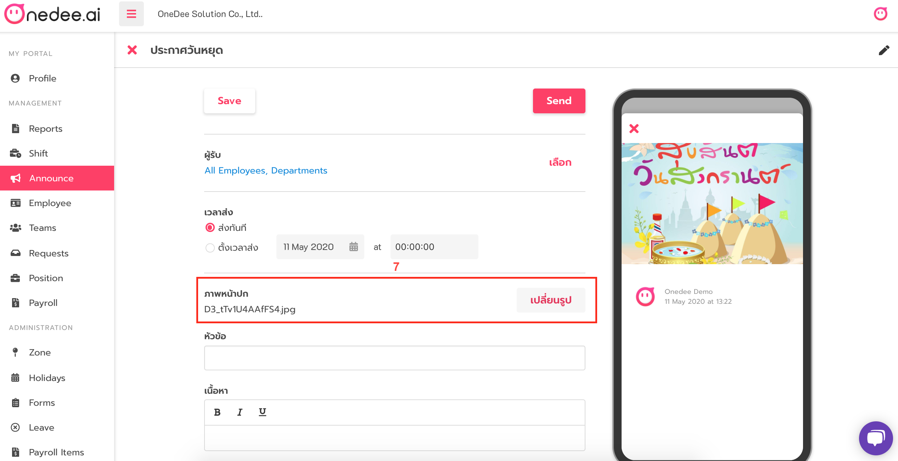
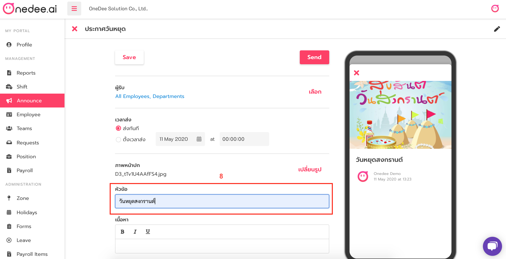
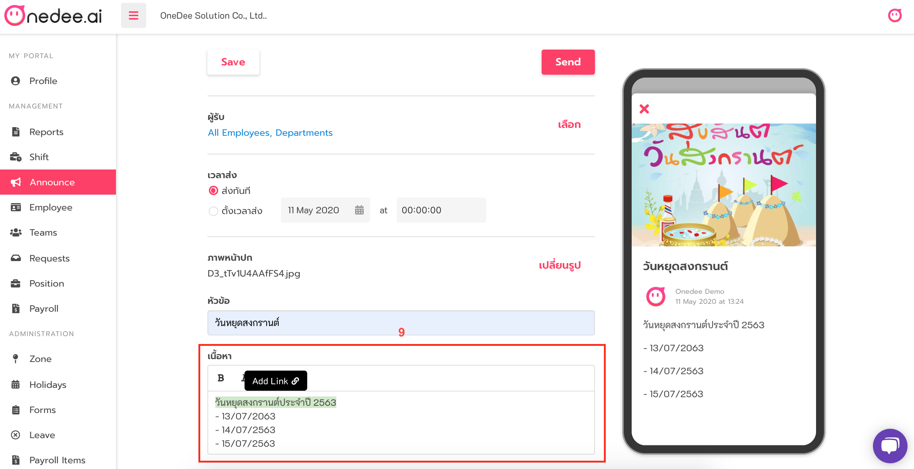

# การสร้างประกาศ \(Announce\)

* เลือกเมนู **Announce \(ประกาศ\)**
* เลือก **New Announcement** เพื่อสร้างประกาศ

* **กรอกชื่อ**ประกาศที่ต้องการสร้าง
* **กรอก Code** \(รหัส\) \*ถ้ามี
* เสร็จแล้วกด **Create** 

* กด **เลือก** ผู้รับ

* **ผู้รับ** สามารถกำหนดเป็นพนักงาน หรือ Department ก็ได้

* **เวลาส่ง** สามารถเลือกส่งทันทีหลังจากทำประกาศเสร็จ หรือกำหนดวันเวลาในการส่งได้

* สามารถใส่ภาพประกอบในการประกาศได้

* กรอก **หัวข้อ** ที่ต้องการประกาศ

* กรอกรายละเอียดที่ต้องการ และ รายละเอียดบางข้อความสามารถเพิ่ม Link ในข้อความนั้นๆ ได้ โดยการคลุมข้อความที่ต้องการเพิ่ม Link และ Copy link ที่ต้องการ วางลงในช่องสีดำแล้ว Enter

* เสร็จแล้วกด Save ได้เลย แต่หากต้องการส่งทันที สามารถกด Send ได้เช่นกัน ระบบก็จะทำการ Save ให้อัตโนมัติ

