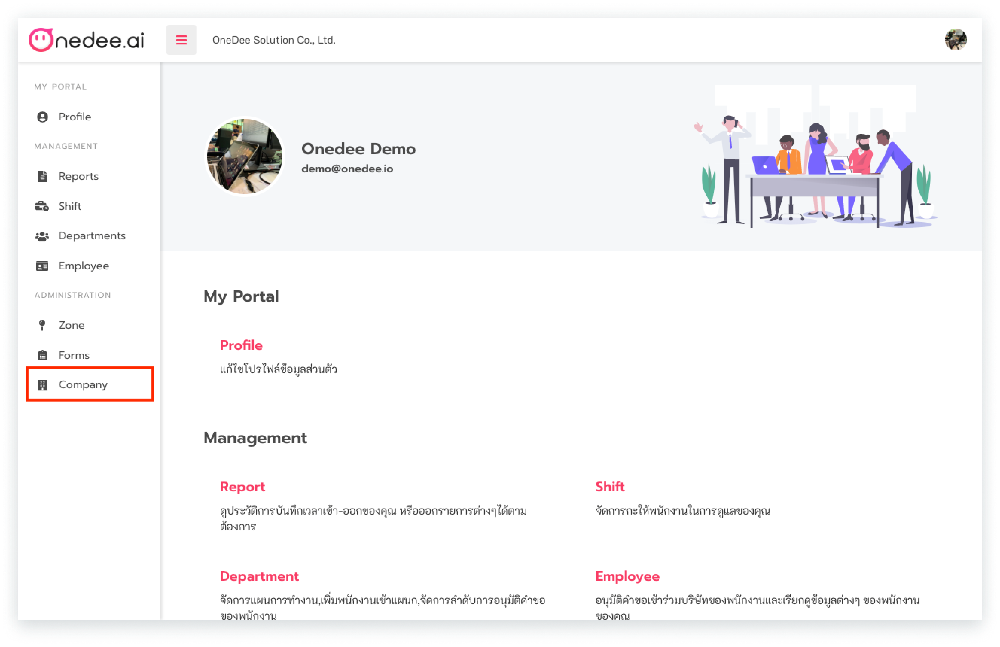
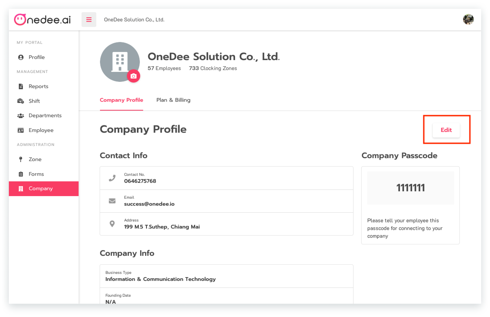
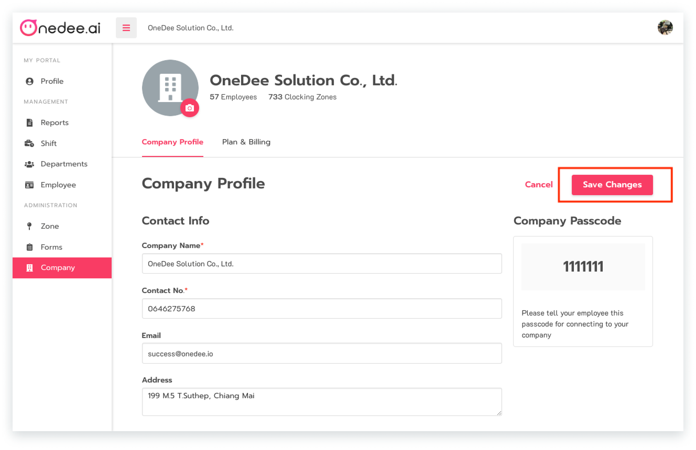

# การเรียกดูและแก้ไขข้อมูลบริษัท \(Company\)

### การเรียกดูข้อมูลบริษัท \(Company\)

* คลิกเมนู Company

### การแก้ไขข้อมูลบริษัท \(Company\)

* คลิกปุ่ม **Edit**

* คลิกปุ่ม **Save Changes** เพื่อทำการบันทึกข้อมูลบริษัทที่ได้ทำการกรอกไว้

