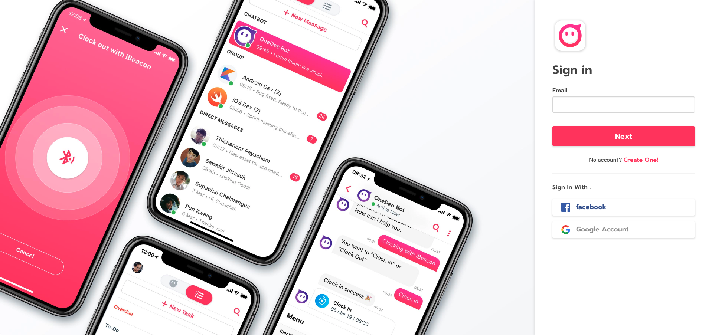
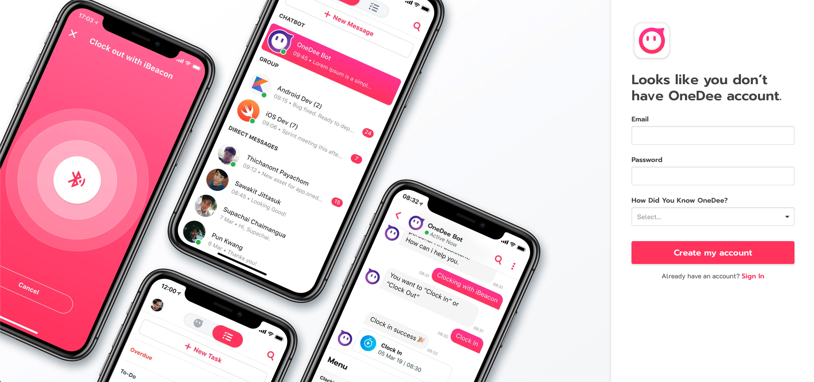
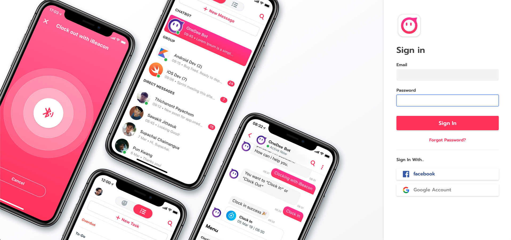

# การสร้างบัญชี OneDee.ai



## ขั้นตอนการสร้างบัญชี OneDee

* เข้า [https://app.onedee.ai](https://app.onedee.ai)  

* คลิก **Create One**
* กรอก **Email และ** **Password** พร้อมกับตอบคำถามว่ารู้จัก **OneDee** ได้อย่างไร
* คลิก **Create My Account**

* ระบบทำการส่งอีเมลยืนยันไปยังอีเมลของคุณ

**หลังจากยืนยันอีเมล**

* กลับมายัง [https://app.onedee.ai](https://app.onedee.ai)  
* กรอก **อีเมล** 
* คลิก **Next** 
* กรอก **Password**
* คลิก **Sign In**

