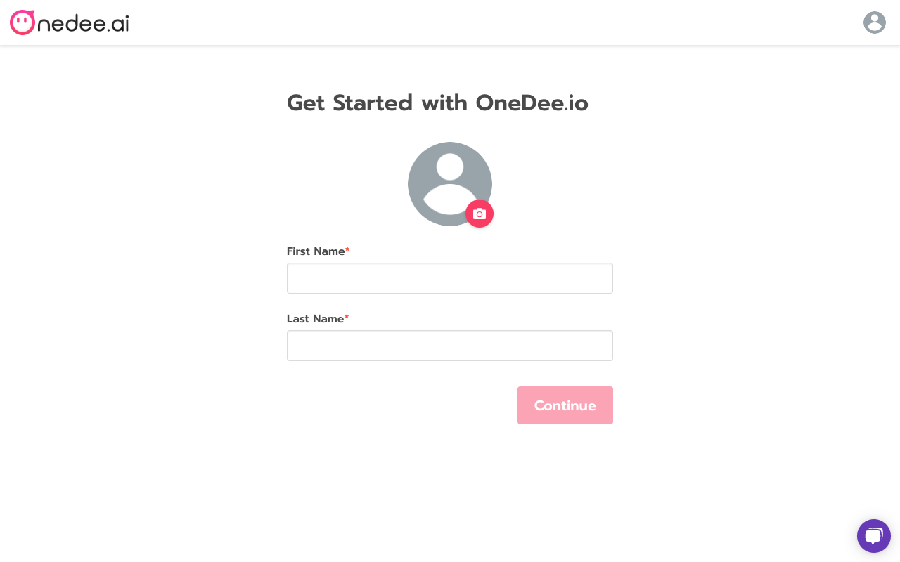
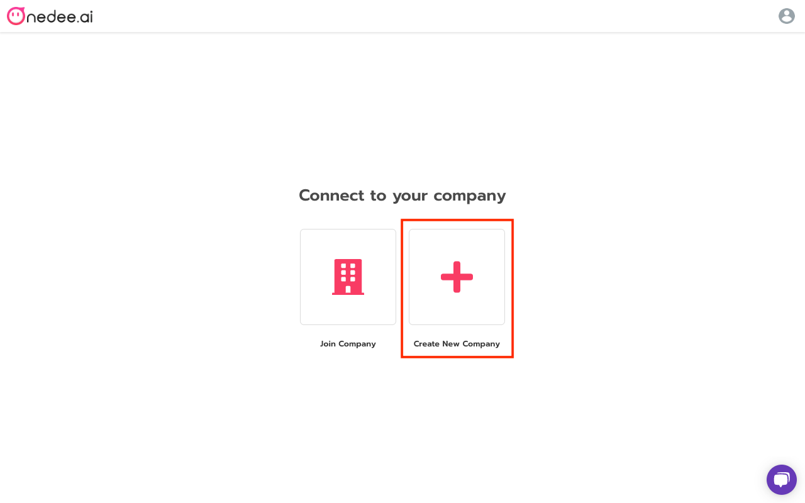
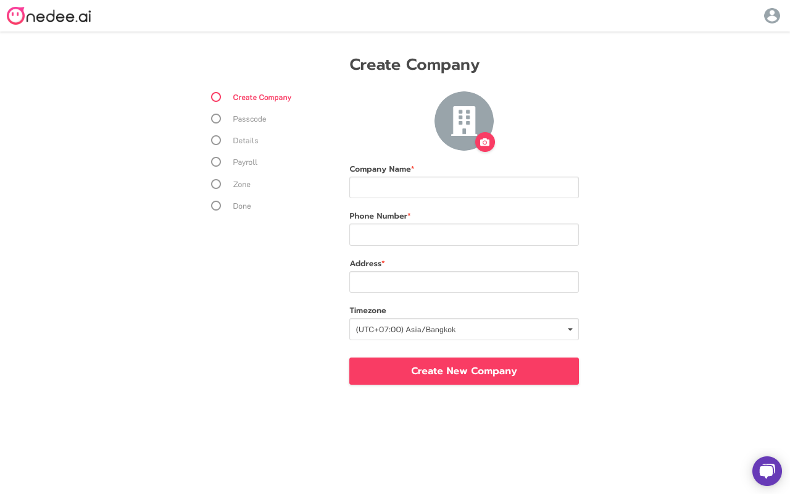
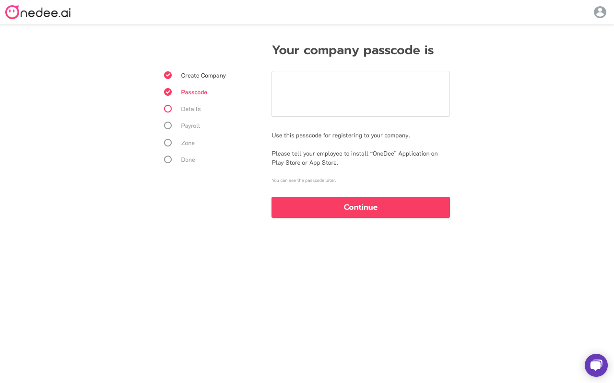
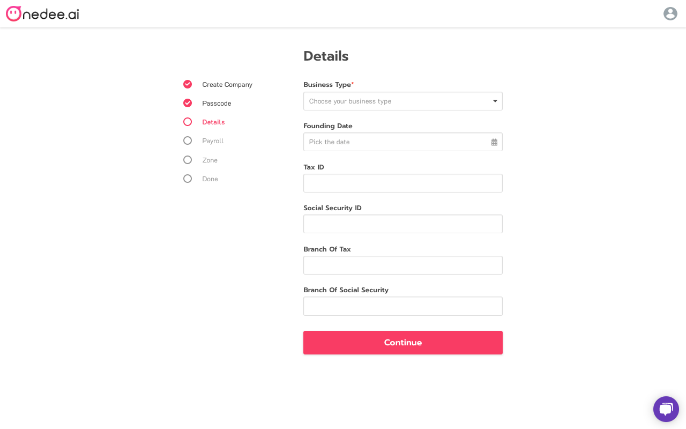
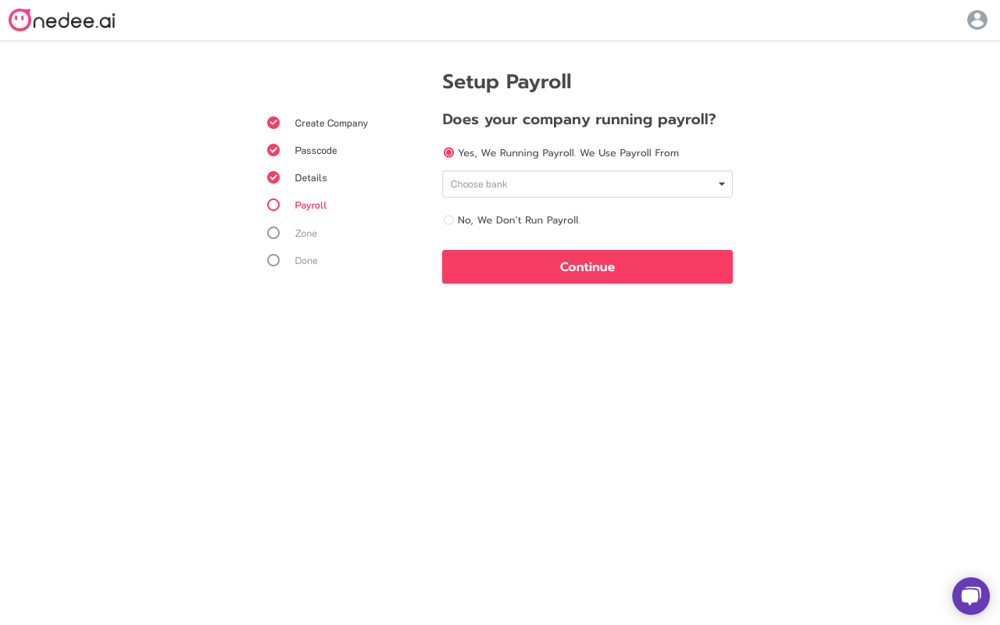
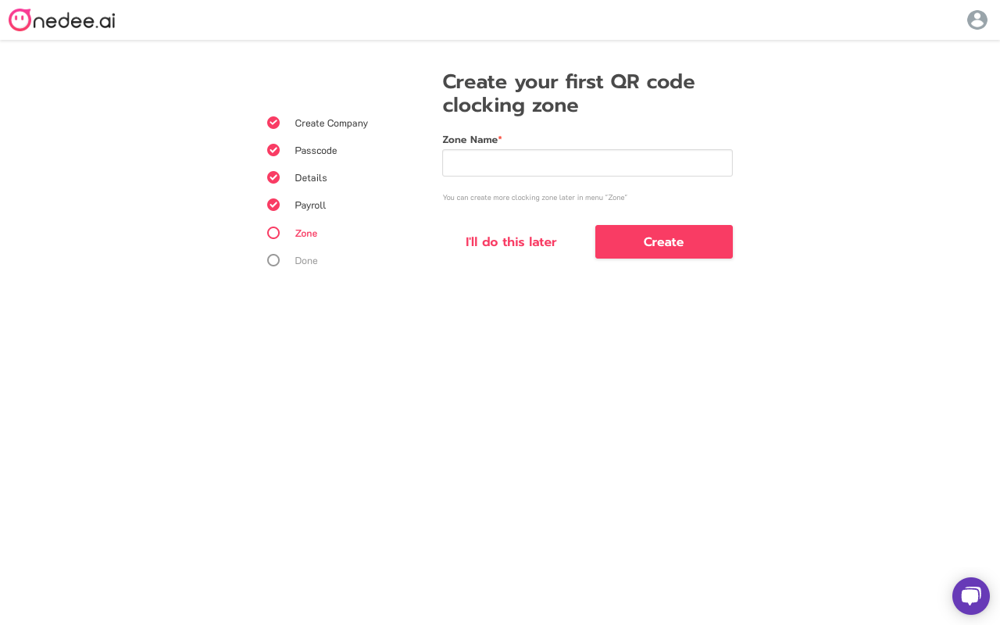
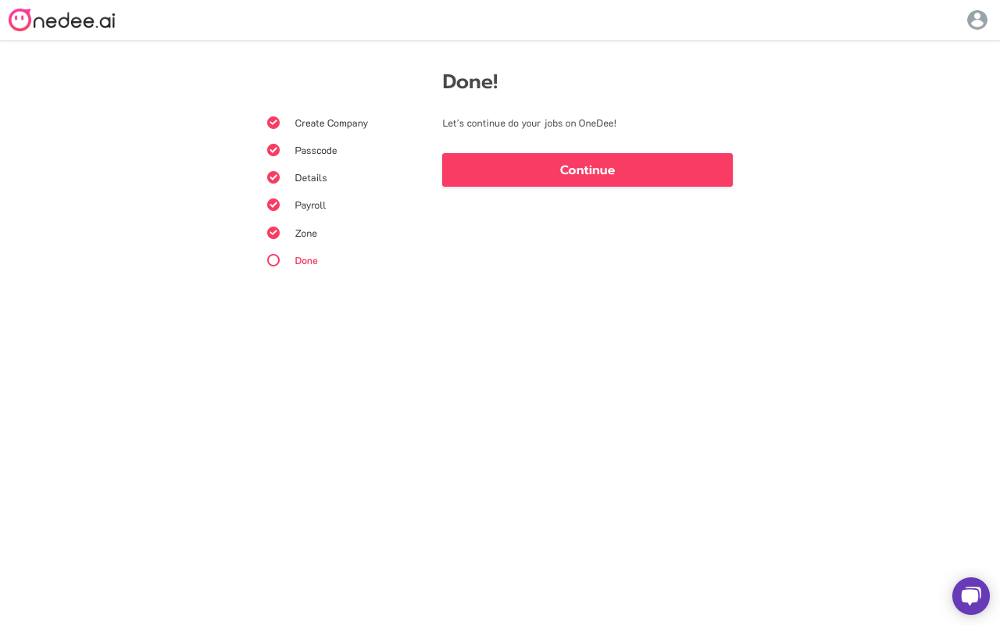

# การสร้างบริษัท

## วิธีการสร้าง Profile \(สำหรับผู้ดูแลระบบ\) 

หลังจากทำการเข้าสู่ระบบ จะไปยังหน้า **Set up Profile**

* **เพิ่มรูปประจำตัว**
* กรอก **ชื่อจริง, นามสกุล** ตามลำดับ
* คลิก **Continue**

หลังจาก **Set up Profile** แล้ว จะเป็น **การสร้างบริษัท**

* เลือก **Create New Company**

## วิธีการสร้างบริษัท 

* **เพิ่มรูปบริษัท**
* กรอก **ชื่อบริษัท, เบอร์โทรศัพท์, ที่อยู่** ตามลำดับ
* เลือก **เขตเวลา**
* คลิก **Create New Company**

* ระบบจะแสดงหน้า **Passcode** หลังจากสร้างบริษัท
* คลิก **Continue**

* แสดงหน้ากรอก**รายละเอียดเพิ่มเติม**
* เลือกประเภทธุรกิจของคุณ พร้อมกรอกข้อมูลต่างๆ ตามลำดับ
* คลิก **Continue**

* ระบบจะแสดงหน้า **Setup Payroll**
* เลือกข้อมูลธนาคารที่บริษัทคุณออกเงินเดือน
* คลิก **Continue**

* ระบบจะแสดงหน้า สร้างจุดลงเวลา QR Code ของบริษัท
* กรอก **ชื่อจุดลงเวลา** ที่ต้องการ
* คลิก **Continue**


**ภายหลัง** ใช้ในกรณีที่ต้องการสร้างภายหลัง


* แสดงหน้า **สำเร็จ**
* คลิก  **Continue**

