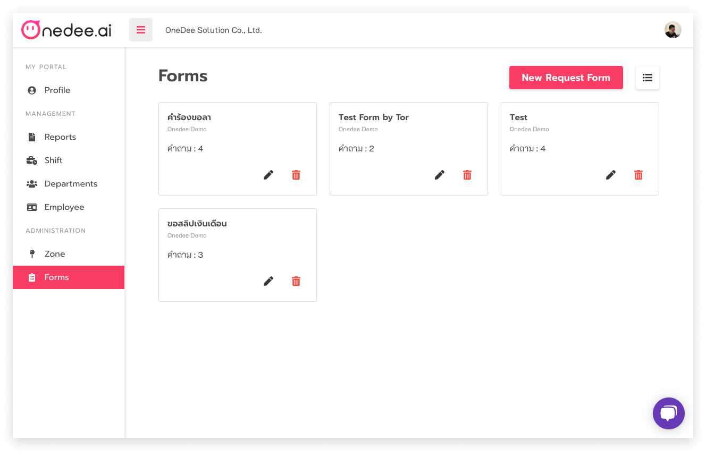
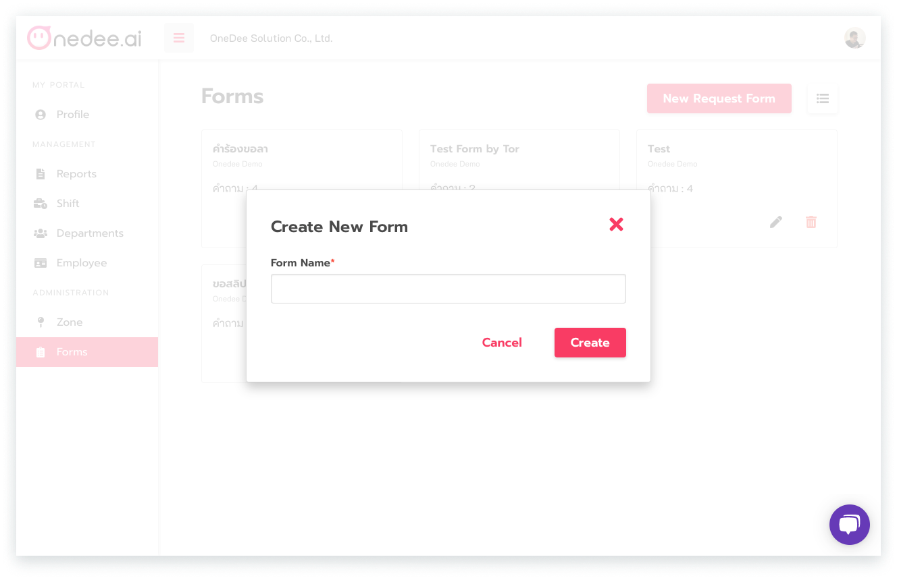
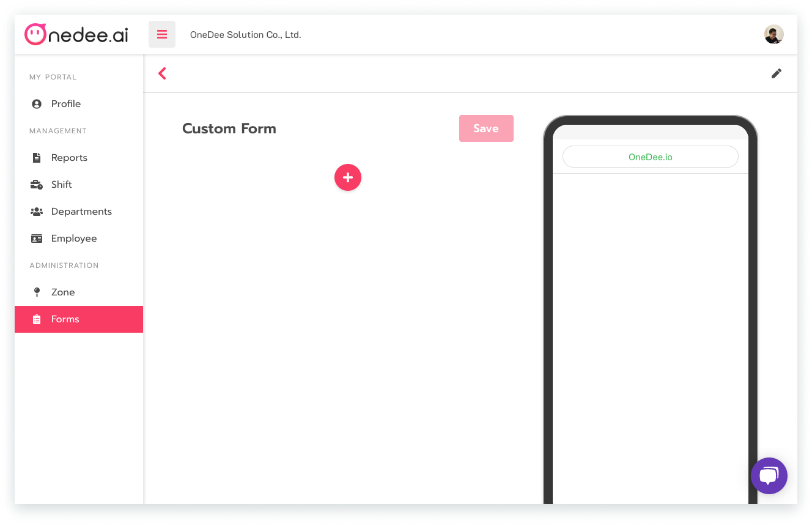
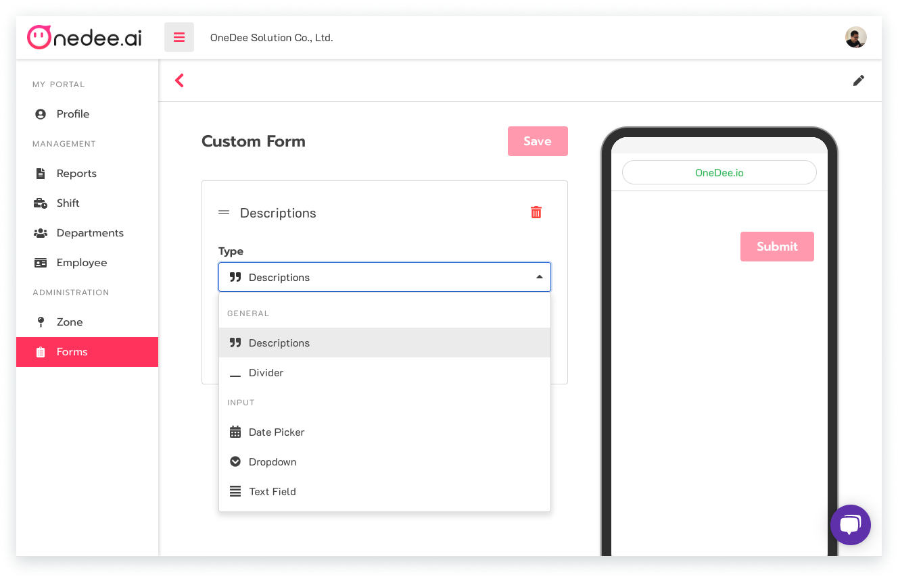
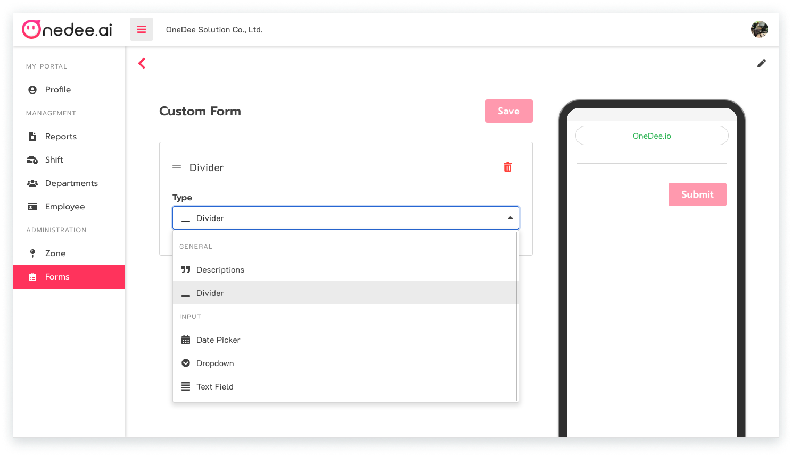
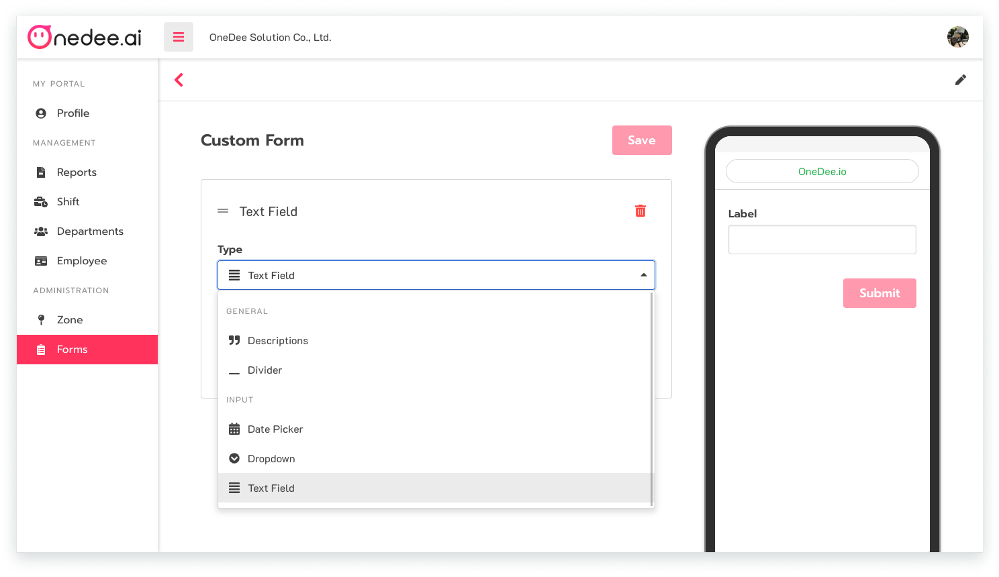
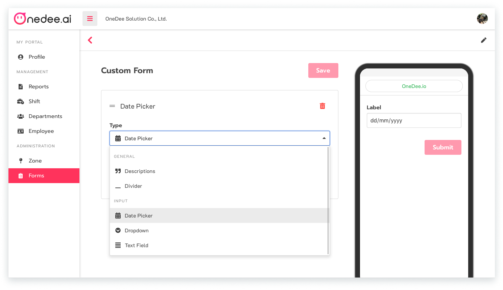
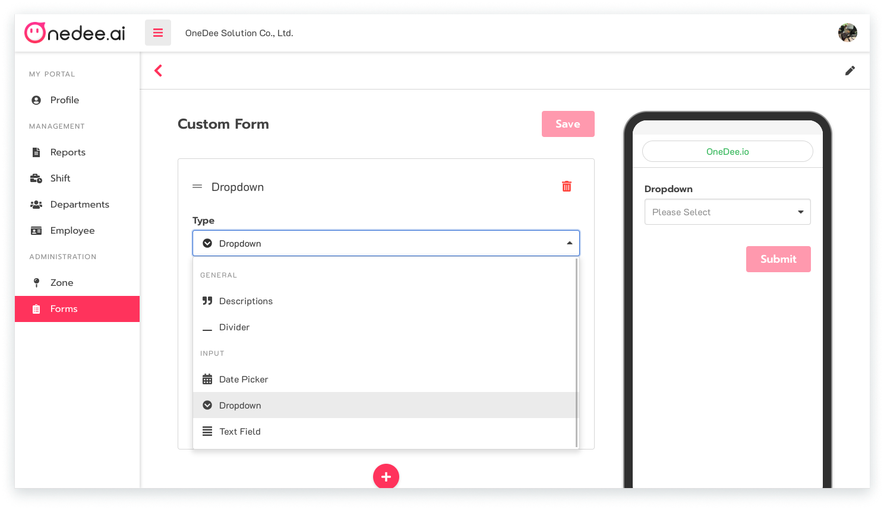

# การสร้างแบบฟอร์มต่างๆ \(Forms\)



* เมนู **Forms** เป็นเมนูสำหรับสร้างแบบฟอร์มต่างๆ เช่น ฟอร์มวันลา ฟอร์มเบิกค่าใช้จ่ายต่างๆ เป็นต้น

* คลิก **New Request Form** 
* ช่อง **Name** กรอกชื่อแบบฟอร์มที่ต้องการสร้าง
* คลิก **Create** เพื่อสร้างแบบฟอร์ม

* คลิกไอคอน  ****เพื่อสร้างรูปแบบของแบบฟอร์ม
* เลือก **ประเภทของข้อมูล**
* คลิก **Save**

* **Descriptions** มีไว้สำหรับ**อธิบายแบบฟอร์มเพิ่มเติม** เช่น ใช้เป็นหมายเหตุของแบบฟอร์มนั้นๆ เป็นต้น

* **Divider** เป็นเหมือน**เส้นกั้นเมนู**

* **Text Field** สามารถกรอกข้อความที่เป็น Text ได้ **อาจใช้เป็นช่องกรอกเหตุผลสำหรับการขอแบบฟอร์ม**นี้ เช่น เหตุผลในการขอเบิก เป็นต้น

* **Date Picker** เป็นเมนูสำหรับ**สร้างวันเดือนปี**ในการที่ต้องการให้พนักงานเลือกวันที่ที่ต้องการทำการ

* **Dropdown** เป็นเมนูสำหรับ**สร้างตัวเลือก** 

