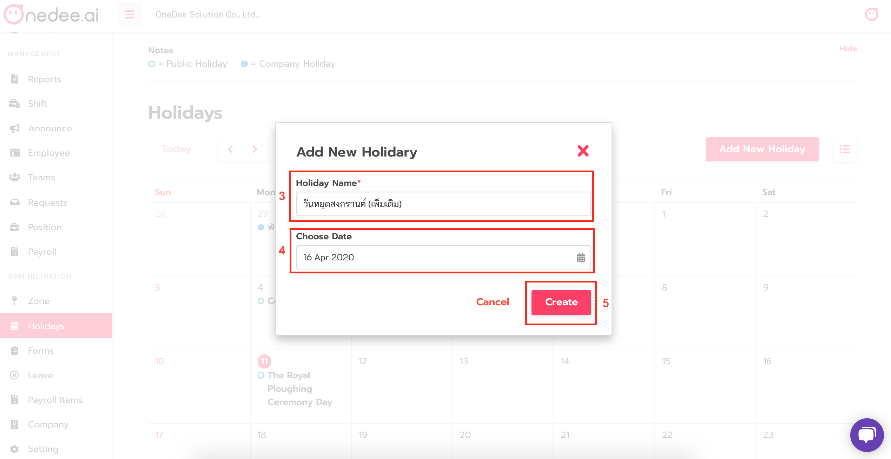

# ปฏิทินวันหยุด \(Holidays\)

* เลือกเมนู **Holidays** \(ปฏิทินวันหยุด\)
* กด **Add New Holiday** เพื่อเพิ่มวันหยุดของบริษัท

* กรอกชื่อวันหยุดที่ต้องการเพิ่มในช่อง **Holiday Name**
* เลือกวันที่ที่ต้งการเพิ่มวันหยุดของบริษัท ใน **Choose Date**
* เสร็จแล้วกด **Create**

* **Public Holiday** = วันหยุดสากล หรือวันหยุดตามกฎหมายแรงงาน ที่ทางระบบได้กำหนดไว้ให้
* **Company Holiday** = วันหยุดของบริษัท สามารถกำหนดได้เอง

