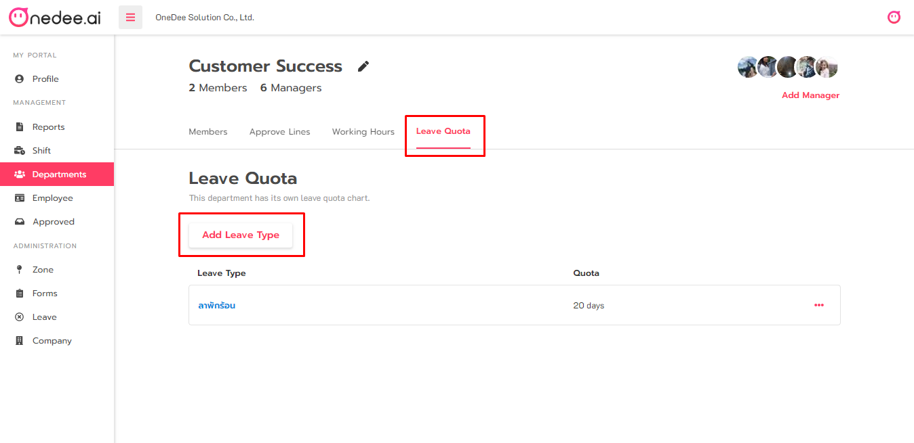
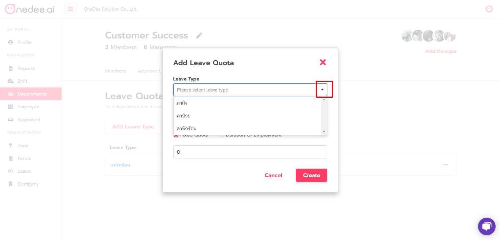
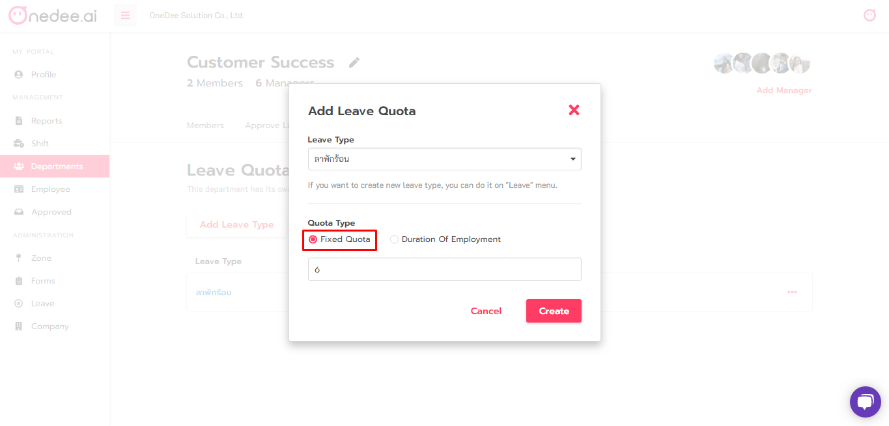
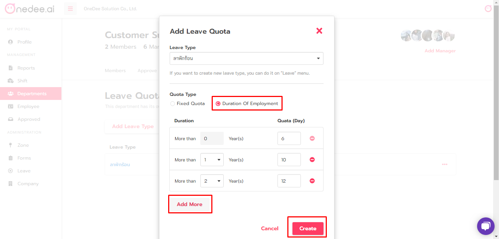

# การสร้างโควต้าวันลา \(Leave quota\)

* คลิกเมนู **Team**
* เลือก **Team** ที่ต้องการ

* เลือกแถบ **Leave Quota**
* คลิก **Add Leave Type** เพื่อเพิ่มประเภทวันลา

* เลือก **Leave Type** ที่ต้องการ

ในช่อง **Quota Type** หากมีโควต้าการลารูปแบบเดียวกันในบริษัท เลือกตั้งค่าได้ที่ **Fixed Quota**

หากบริษัทมีรูปแบบโควต้าการลาแตกต่างกันตามอายุงาน สามารถเลือกตั้งค่าได้ที่ **Duration Of Employment**

