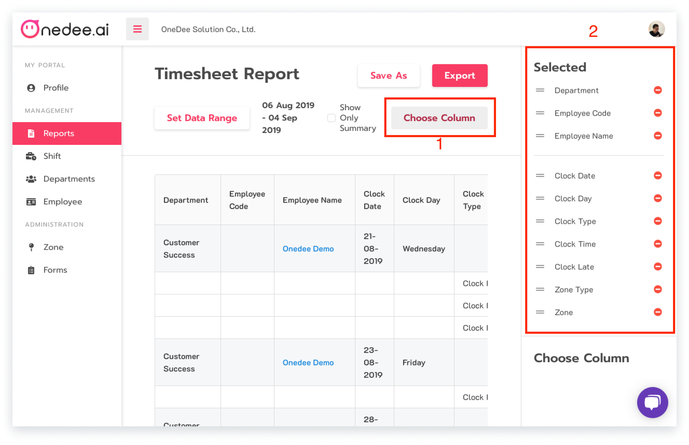

# Timesheet Report



## การเรียกดูรายงาน Timesheet Report

* ไปยังเมนู **Report**
* คลิก Timesheet **Report**

* คลิก ไอคอน **"..."** แล้วเลือก **View** หรือ คลิก **ชื่อ Template**
* คลิก **Choose Column**
* คลิก ไอคอน  เพื่อซ่อน **Column** ที่ไม่ต้องการแสดง หรือ คลิก ไอคอน  เพื่อแสดง **Column** ที่ต้องการแสดง

## การเรียกดูรายงานตามการค้นหา

* คลิก **Set Data Range**

* เลือก **ช่วงวันที่**
* เลือก **การค้นหา**แบบ **ชื่อพนักงาน**, **จุดลงเวลา**, **แผนก/สาขา**
* เลือก **ข้อมูลที่ต้องการแสดง แผนก/สาขาทั้งหมด, กำหนดแผนก/สาขา**
* คลิก **Apply**

## การบันทึกรายงานให้เป็นของตัวเอง

* คลิก **Save As**

* กรอก **ชื่อรายงาน**
* คลิก **Save**

## การ Export รายงาน


สามารถ **Export** ได้ทั้งไฟล์ CSV. Excel และ Text file


*  คลิก **Export**

