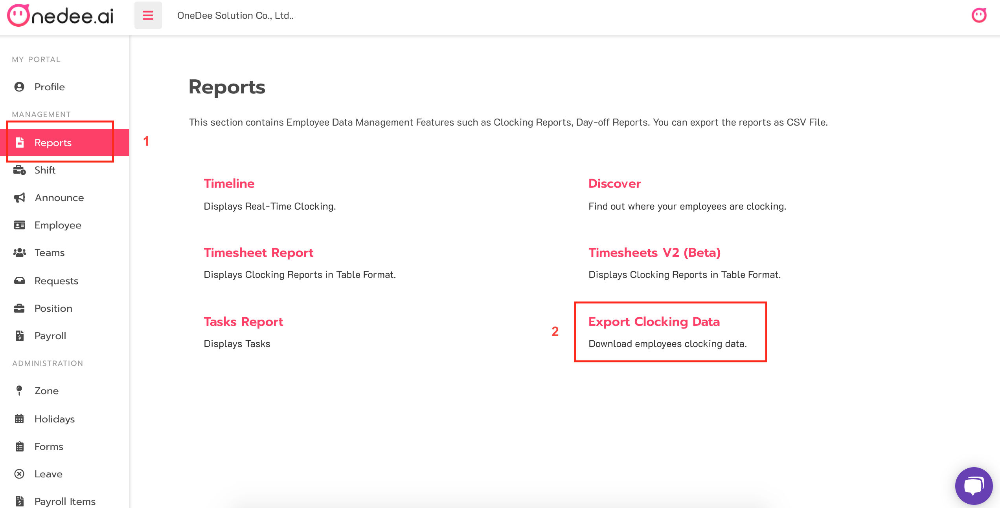
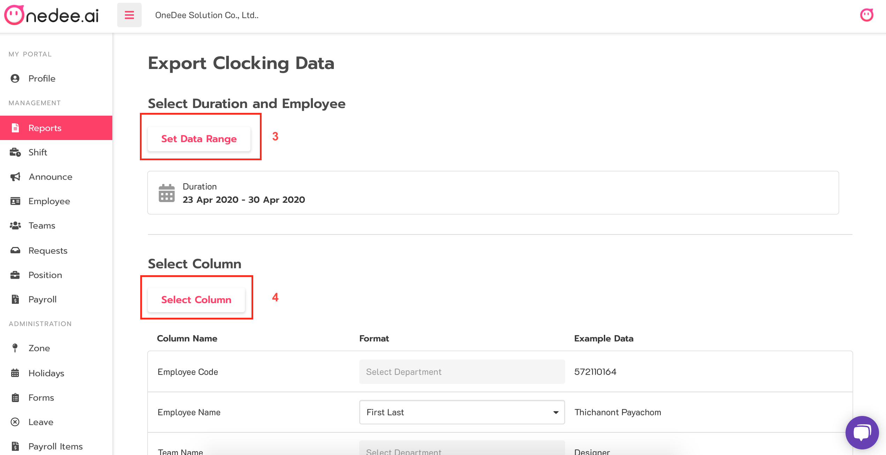
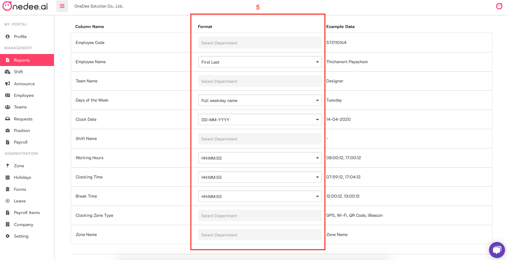
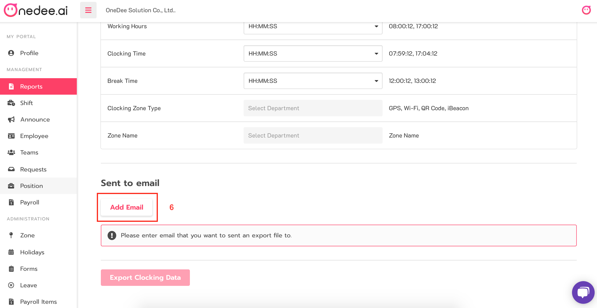
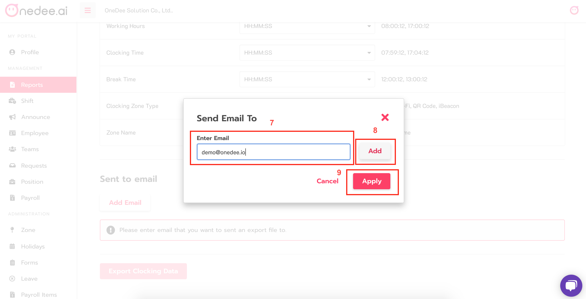
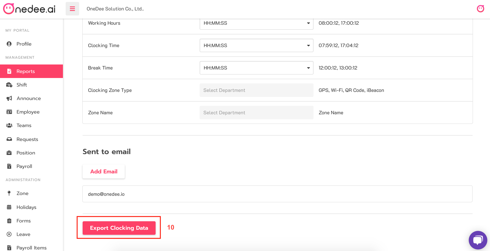
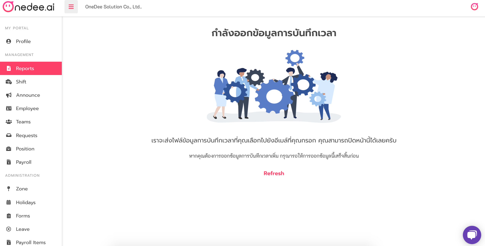

# Export Clocking Data

* คลิกเมนู **Report**
* เลือก **Export Clocking Data**

* กำหนดช่วงวันที่ที่ต้องการที่ **Set Data Range**
* กำหนดคอลัมน์ที่ **Select Column**

* เลือก **Format** ที่ต้องการ

* **Add Email** เพื่อทำการส่งไฟล์

* กรอกอีเมลที่ต้องการ
* เลือก **Add** เพื่อเพิ่มอีเมล
* เสร็จแล้วเลือก **Apply**

* เสร็จแล้วเลือก **Export Clocking Data** 

* ไฟล์รายงานจะถูกส่งไปยังอีเมลที่กรอกไว้ สามารถ Download ไฟล์รายงานได้ที่อีเมลได้เลย

