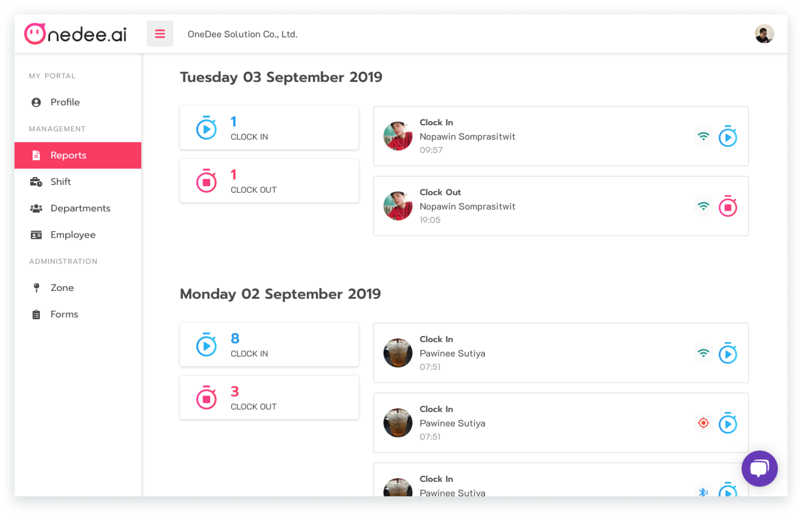

# Timeline Report



## วิธีการเรียกดูรายงาน Timeline

* ไปยังเมนู **Report**
* คลิก **Timeline**

ภายในหน้า **Timeline** จะแสดงข้อมูลการ**ลงเวลาเข้า-เลิกงาน**ของพนักงาน และรวมไปถึงการ**พักเบรก**ของพนักงานอีกด้วย

