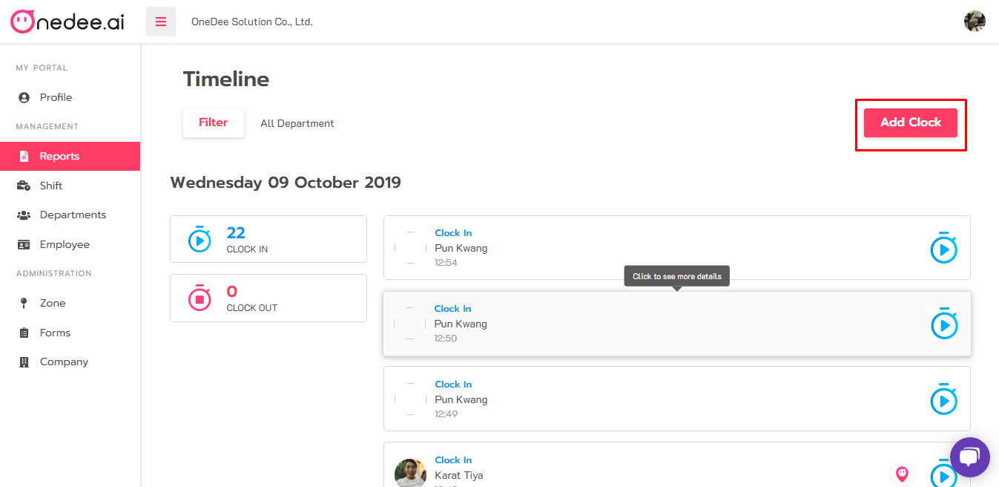
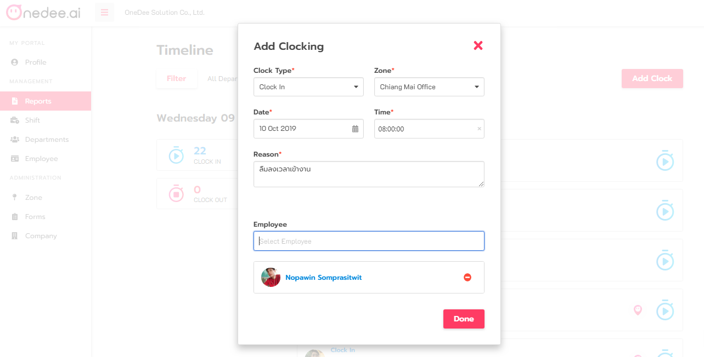

# Add Clock \(ลงเวลาแทน\)

## ลงเวลาแทนพนักงานได้ตอนไหน

#### Add Clock หรือ การลงเวลาแทน สามารถทำได้ 2 กรณี ดังนี้

* พนักงานลืมโทรศัพท์มือถือ
* พนักงานลืมลงเวลาเข้า-ออกงาน หรือลืมพักเบรก-ออกเบรก

## ขั้นตอนการ Add Clock

* ไปยังเมนู **Report**
* คลิก **Timeline**

* คลิกปุ่ม **Add Clock**

* เลือก **Clock Type** \(ประเภทการลงเวลา\)
* เลือก **Zone** \(จุดลงเวลา\)
* เลือก **Date** \(วันที่\)
* เลือก **Time** \(เวลา\)
* กรอก **Reason** \(เหตุผล\)
* เลือก **Employee** \(พนักงาน\) 
* เสร็จแล้ว คลิกปุ่ม **Done** 

