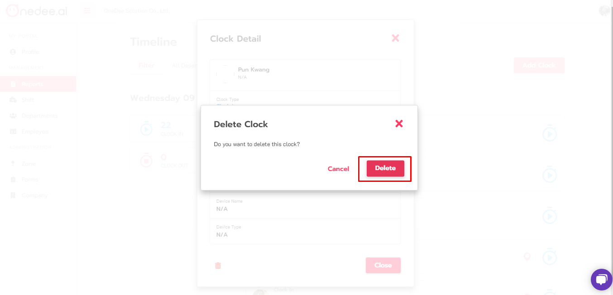

# Delete Clock \(ลบเวลา\)

## ขั้นตอนการ Delete Clock \(ลบเวลา\)

* ไปยังเมนู **Report**
* คลิก **Timeline**

* คลิก **แถบเวลา** ที่ต้องการลบ

* คลิกไอคอน **รูปถังขยะ** เพื่อลบเวลา

* คลิก **Delete** \(ลบ\)

