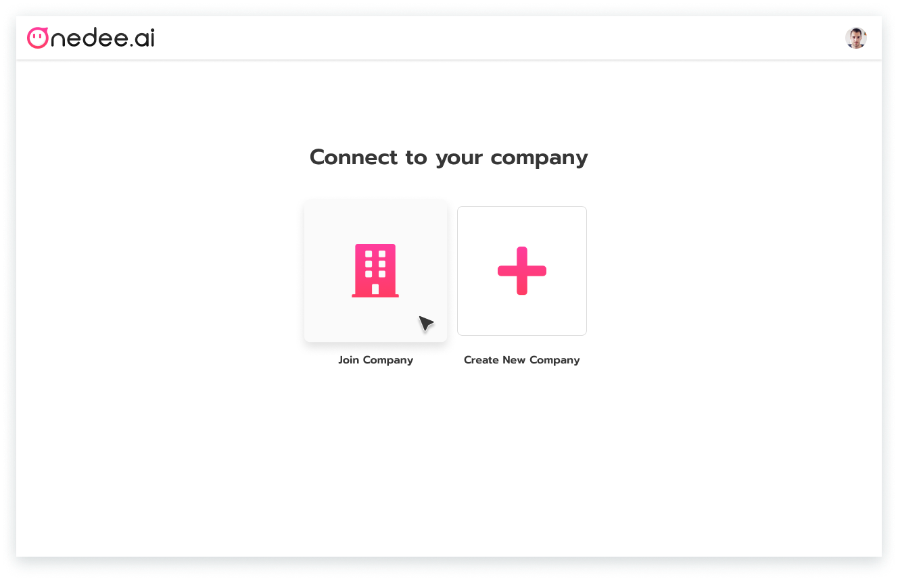
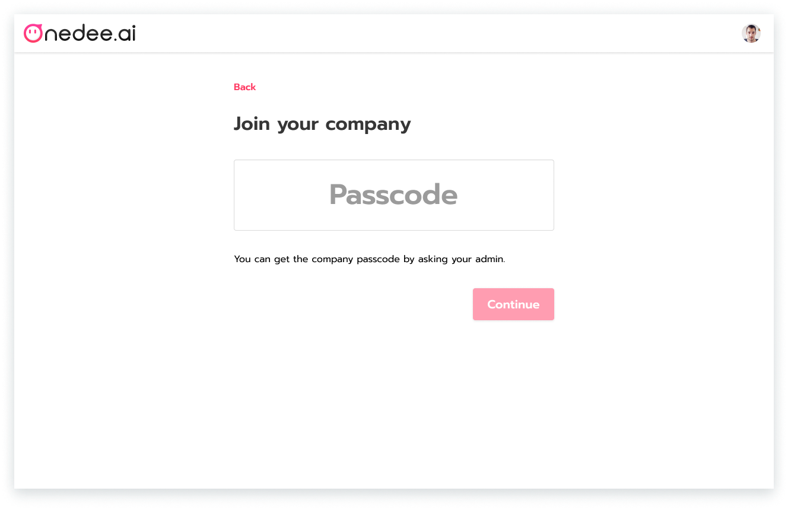
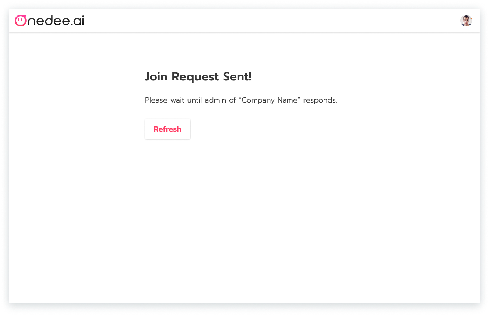

# การขอเข้าร่วมบริษัท

## วิธีการสร้าง Profile \(สำหรับผู้ดูแลระบบ\)

หลังจากทำการเข้าสู่ระบบ จะไปยังหน้า **Set up Profile**

* **เพิ่มรูปประจำตัว**
* กรอก **ชื่อจริง, นามสกุล** ตามลำดับ
* คลิก **Continue**

หลังจาก **Set up Profile** แล้ว จะเป็น **การขอเข้าร่วมบริษัท**

## วิธีการขอเข้าร่วมบริษัท 

* เลือก **Join Company**

* กรอก **Passcode** ของบริษัทที่ต้องการจะเข้าร่วม
* คลิก **Continue**

* คลิกปุ่ม **Connect to Company** เพื่อขอเข้าร่วมบริษัทดังกล่าว

เสร็จสิ้นการขอเข้าร่วมบริษัท


หลังจากทำการขอเข้าร่วมบริษัทแล้ว ให้ทำการแจ้ง Admin ของบริษัทเพื่อทำการอนุมัติรายการ


