# การสร้างแผนก/สาขา \(Team\)

## ขั้นตอนการสร้าง Team

* คลิก **Create New Team** เพื่อทำการสร้าง **Team** ใหม่

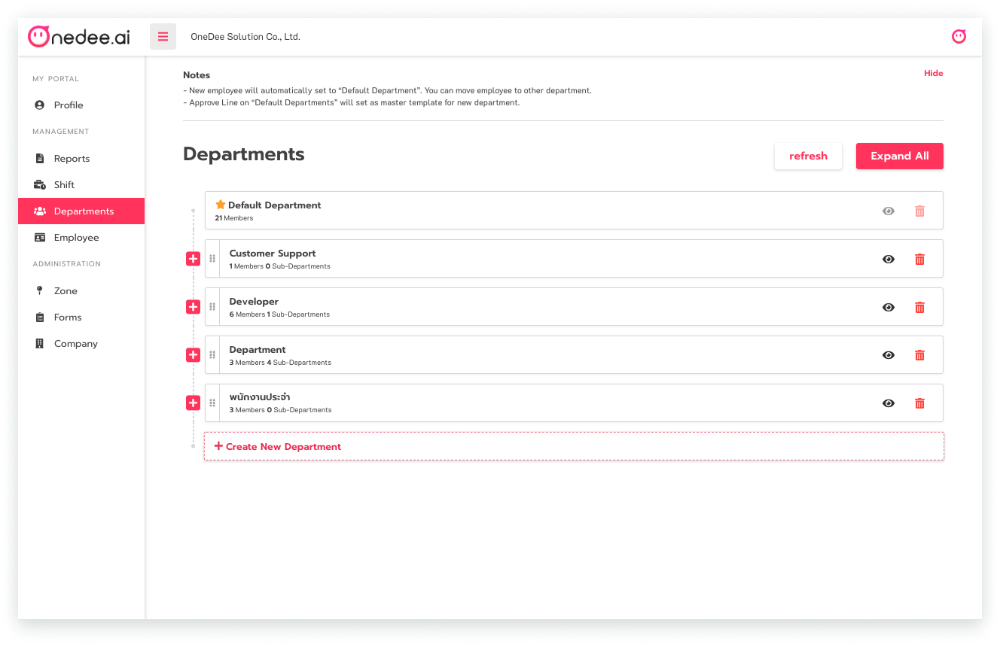

* กรอก **ชื่อแผนก/สาขา** ที่ต้องการ
* คลิก **Create**

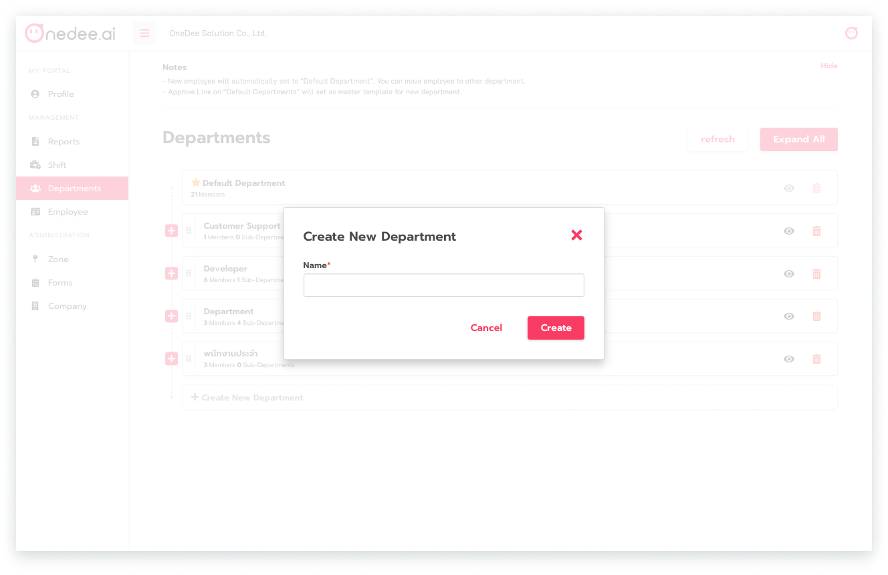

## การสร้าง Sub-Team หรือแผนก/สาขาย่อย

* คลิก  เพื่อขยายให้เห็น **Sub-Team**
* คลิก **Create New Team**

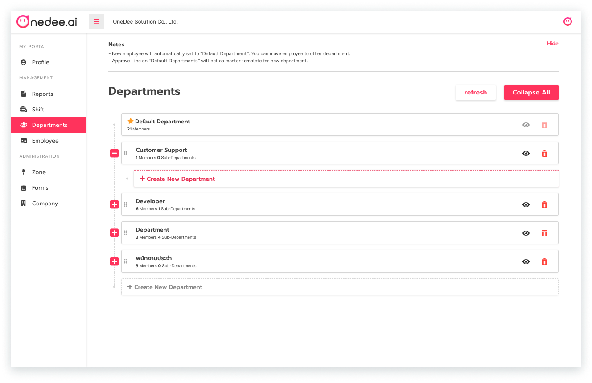

* กรอก **ชื่อแผนก/สาขาย่อย**
* คลิก **Create**

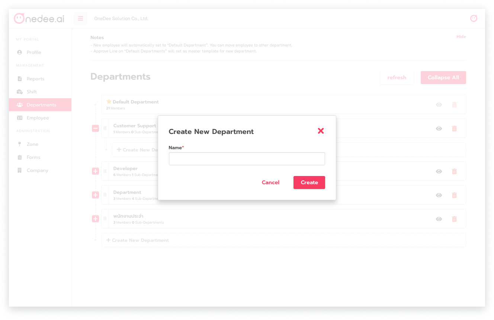

## การเพิ่มพนักงานเข้าแผนก/สาขา \(Members\)

* กรอก **ชื่อพนักงาน**ที่ต้องการที่ **ช่องค้นหาพนักงาน**
* คลิก **ชื่อพนักงาน**ที่ต้องการเพิ่มเข้าแผนก/สาขา

## การสร้าง Flow \(Approve Lines\)

* คลิก **แถบ Approve Line**
* คลิก **New Flow**

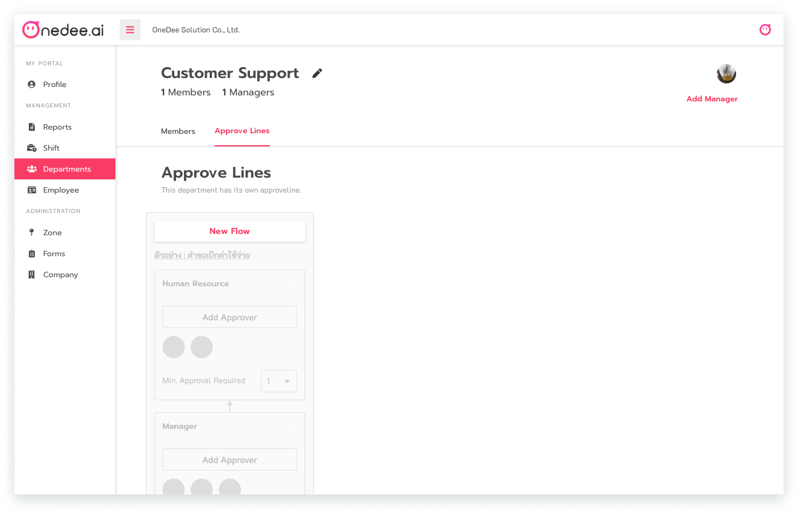

* กรอก **ชื่อ Flow** ที่ต้องการ
* คลิก **Create**

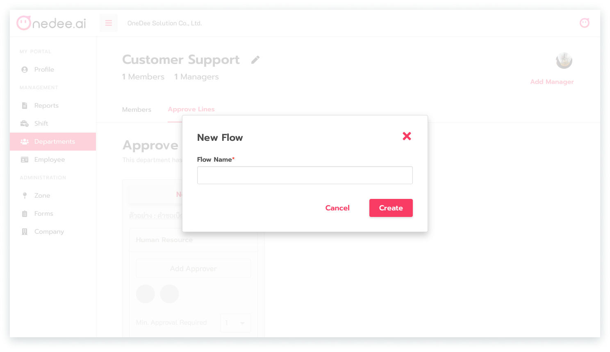

## การตั้งค่าแบบฟอร์มใน Approve Lines

* คลิก **Set up form...**

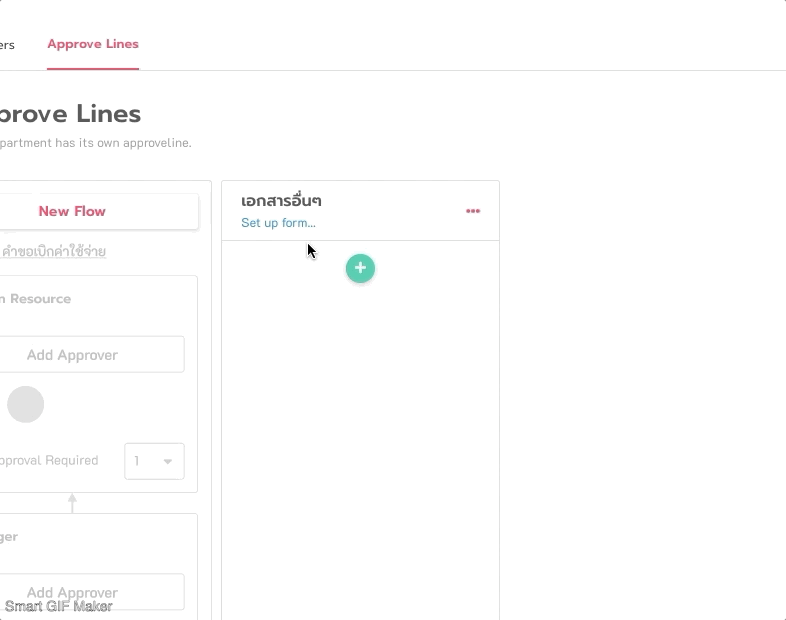

## **การสร้างและกำหนดลำดับการอนุมัติสำหรับการทำรายการคำขอต่างๆ**


* **Manage Approvers** = กำหนดรายชื่อผู้อนุมัติของแต่ละลำดับ
* **Min. Approval Required** = เลือกจำนวนผู้อนุมัติขั้นต่ำของแต่ละลำดับ
* ลำดับกลุ่มการอนุมัติจะเรียงลำดับจาก **ด้านล่าง** ไป **ด้านบน**


* คลิก  เพื่อทำการสร้างหรือกำหนดกลุ่มผู้อนุมัติสำหรับ **Approve Line** นี้
* กรอก **ชื่อ Approver Group**
* คลิก **Create**

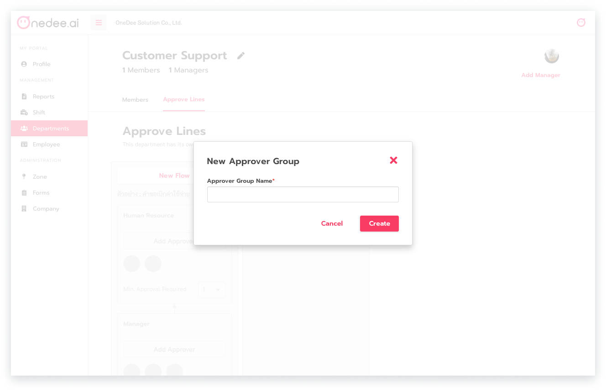

* คลิก **Manage Approver** 
* เลือก **ผู้อนุมัติ**
* คลิก **Save**

* คลิก **จำนวนผู้อนุมัติขั้นต่ำ** เพื่อกำหนดว่าจะต้องมีผู้อนุมัติในกล่องนี้กี่คน

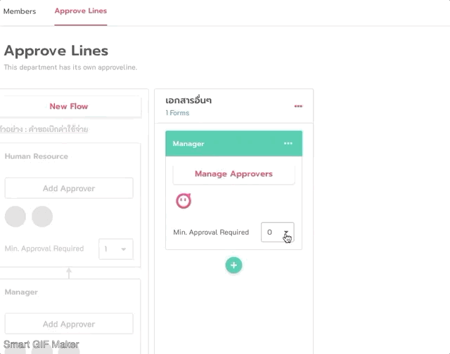

## การกำหนดผู้จัดการในแต่ละ Team

* คลิก **Add Manager**

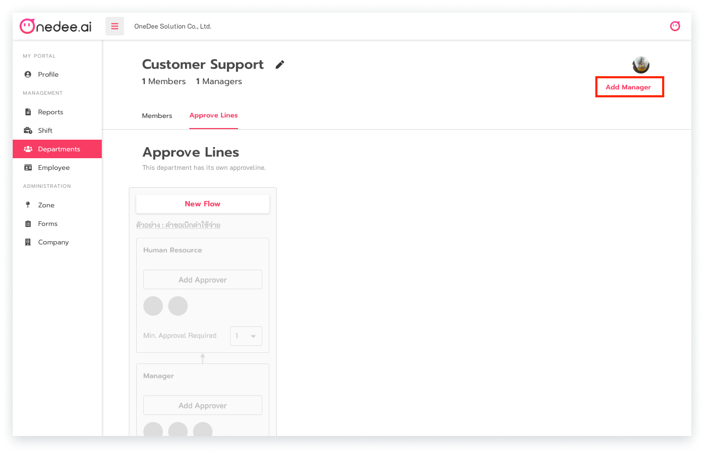

* กรอก **ชื่อที่ต้องการ**
* คลิก **ที่ชื่อ**
* คลิก **Save**

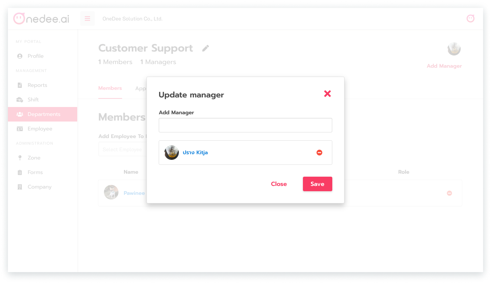

