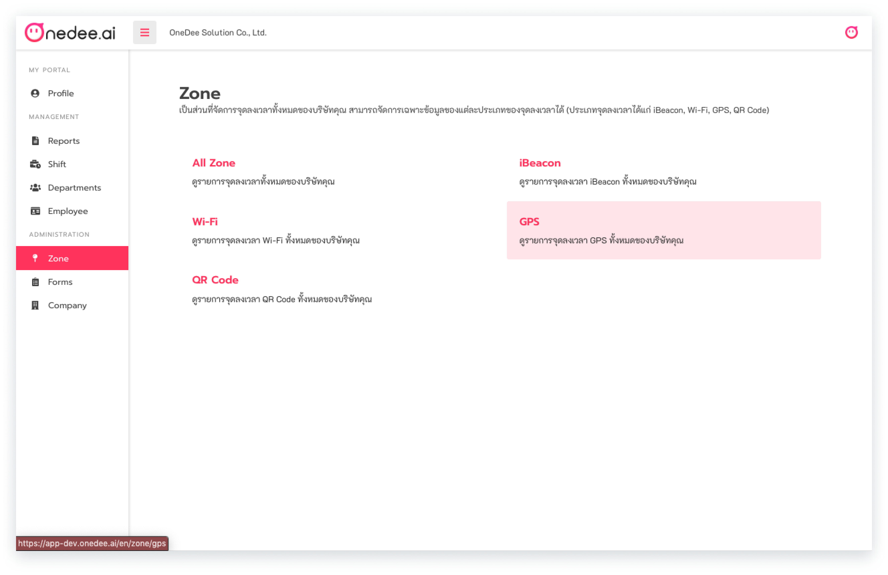
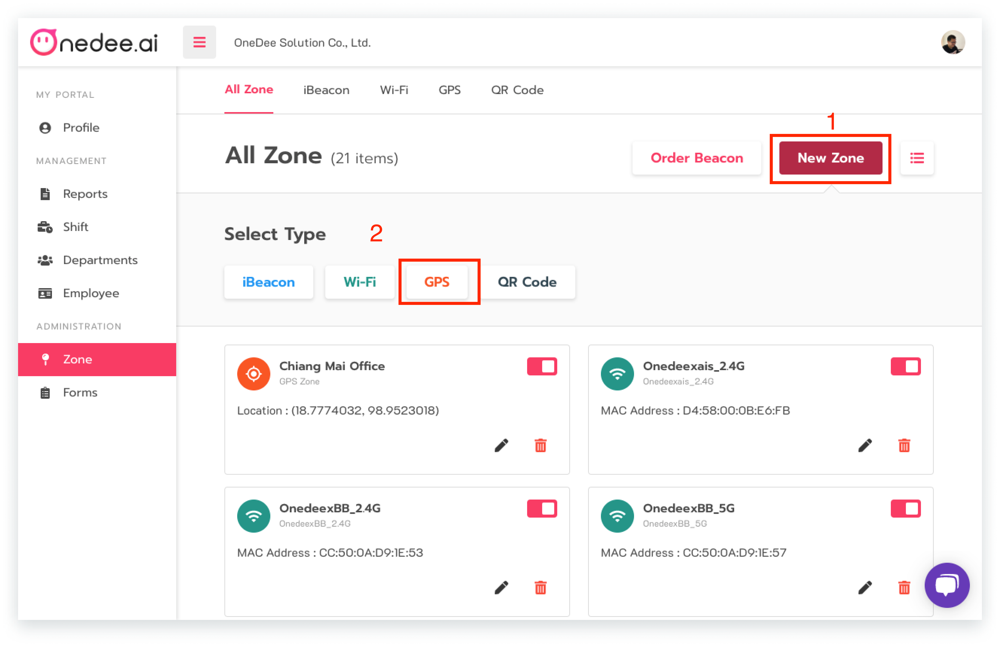
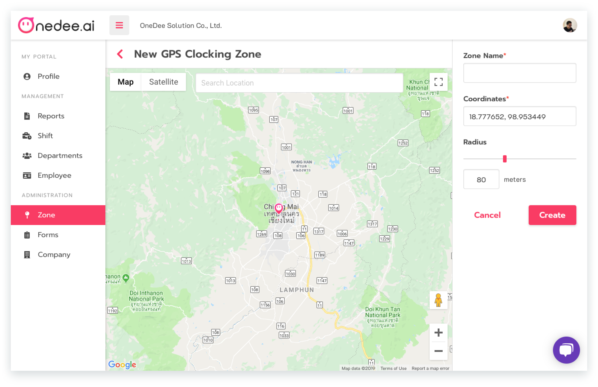

# GPS



## วิธีการสร้างจุดลงเวลา GPS

* ไปยังเมนู **Zone**
* คลิก **GPS**

* คลิก **New Zone**
* คลิก **GPS**

* กรอก **ชื่อพื้นที่ที่ต้องการ**
* กรอก **Latitude** และ **Longitude** หรือ ค้นหาจุดลงเวลาที่ต้องการในช่อง**ค้นหา**
* คลิก **Create**


สามารถปรับรัศมี \(Radius\) จุดลงเวลา ได้ตามความเหมาะสมที่ต้องการ


