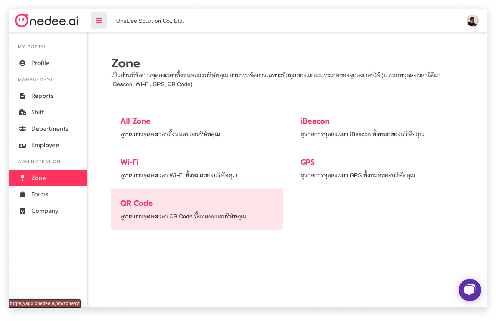
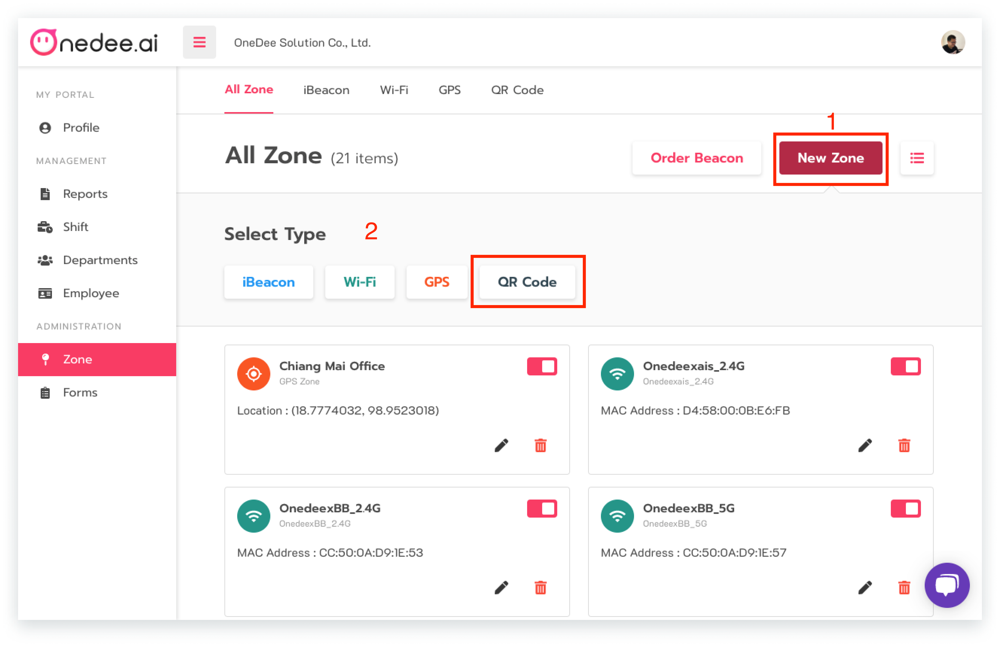
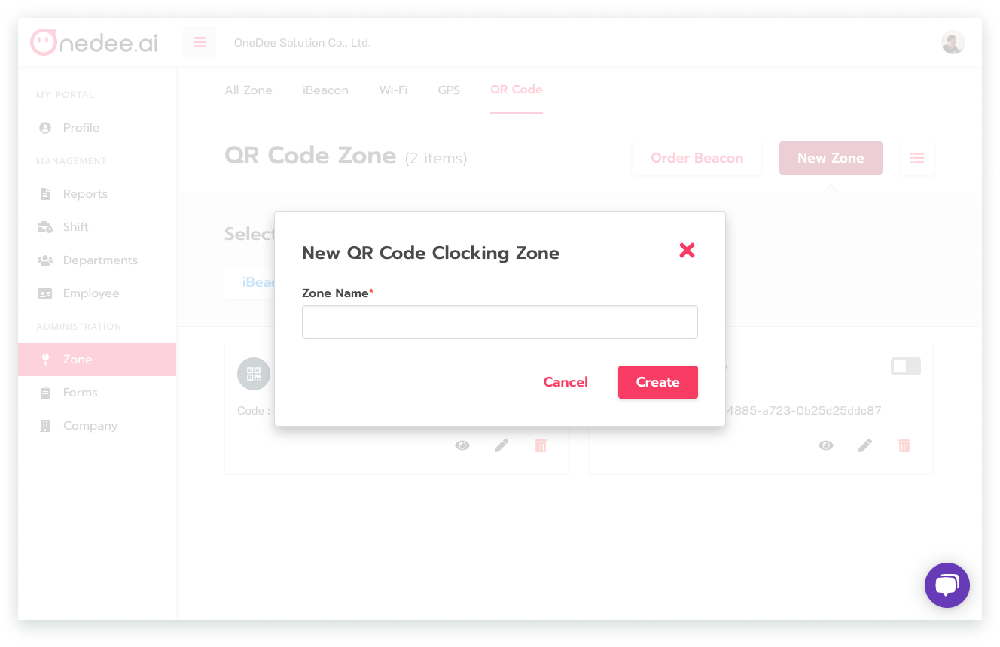
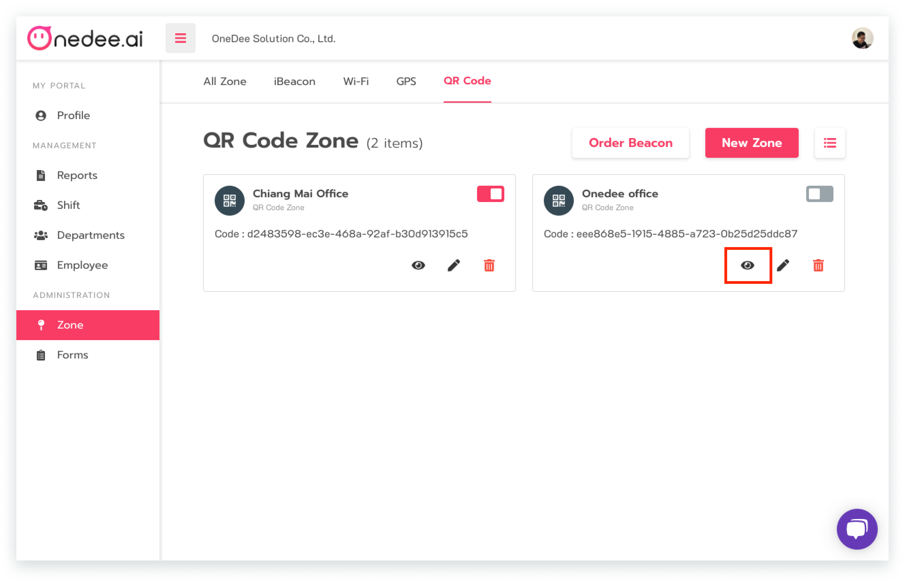
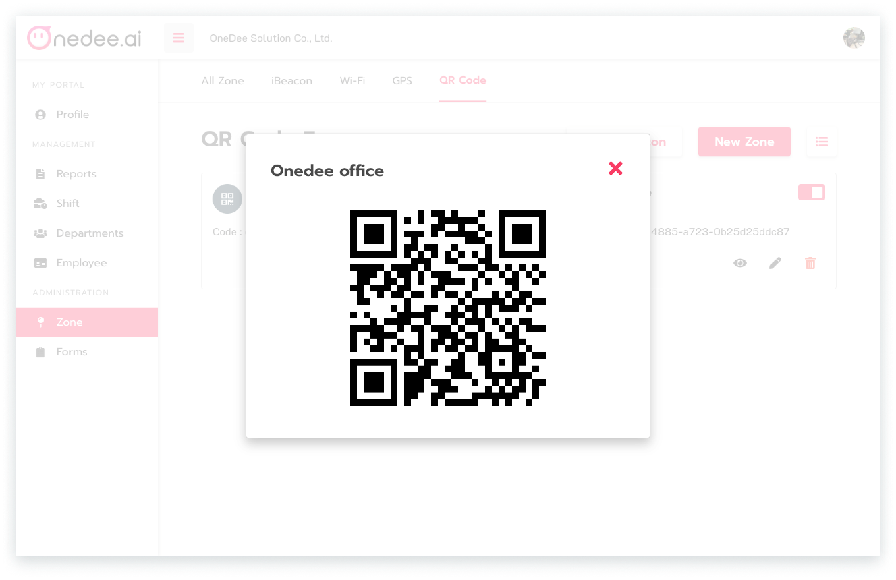

# QR Code



## **วิธีการสร้างจุดลงเวลาแบบ** **QR Code**

* ไปยังเมนู **Zone** 
* คลิก **QR Code**

* คลิก **New Zone**
* คลิก **QR Code**

* กรอก **ชื่อพื้นที่ที่ต้องการ**
* คลิก **Create**

* คลิก ไอคอน "**รูปตา**" เพื่อดู **QR Code**

* คลิก **กากบาท** เพื่อปิด **QR Code**

