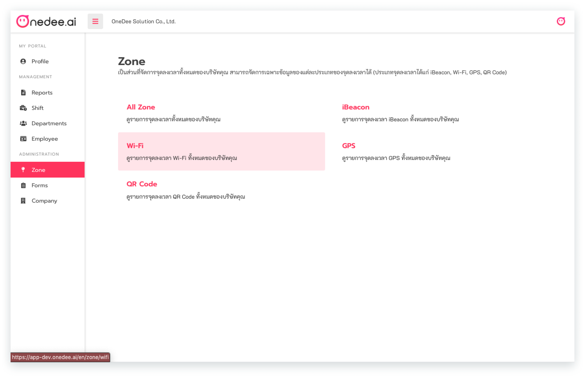
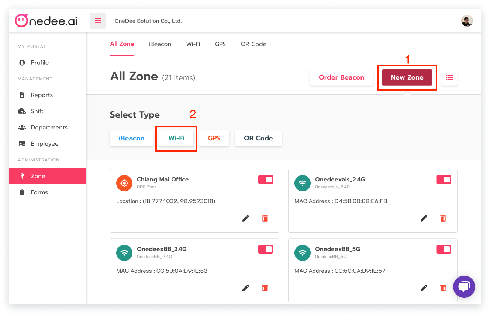
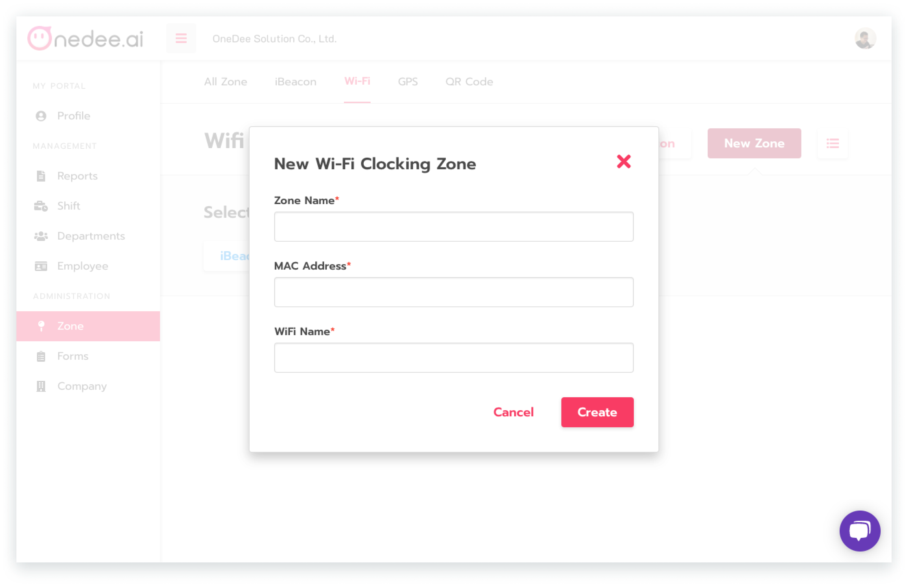

# Wi-Fi



## วิธีการสร้างจุดลงเวลา Wi-Fi

* ไปยังเมนู **Zone**
* คลิก **Wi-Fi**

* คลิก **New Zone**
* คลิก **Wi-Fi**

* กรอก  **ชื่อพื้นที่ที่ต้องการ**
* กรอก **Mac Address**
* กรอก **ชื่อ Wi-Fi**
* คลิก **Create**


**Mac Address**  สามารถหาได้จาก **Router Wi-Fi** หรือ โหลดแอพพลิเคชั่น **WiFi Analyzer**


